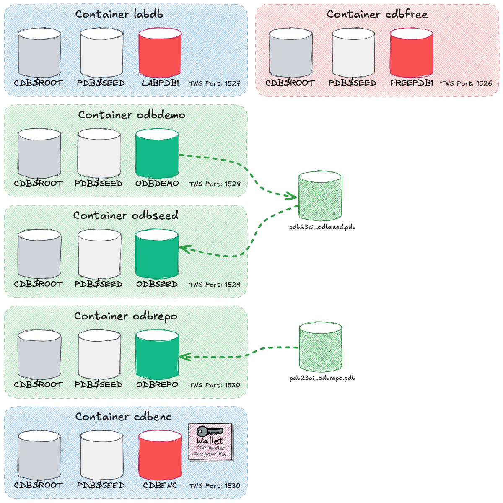

# Oracle AI Database 26ai Free OraDBA Lab Environment

This repository delivers a **container-based lab environment** for *Oracle AI Database Free 26ai*, designed for testing, training, and engineering use cases within the **OraDBA Lab Environment**.
It comes with preconfigured services, scripts, and supporting files that make it easy to set up and run Oracle AI Database instances — with or without EA Sparx repositories — using **Docker** or **Podman**. The setup is optimized for **reproducibility**, allowing labs to be reset or cloned quickly for consistent results.

## Requirements

Before starting, ensure you have the following:

- Docker or Podman installed and configured  
- Oracle AI Database container images (e.g. Oracle AI Database 26ai Free)  
  See [Oracle AI Database 26ai Free Container Image Documentation](https://container-registry.oracle.com/ords/ocr/ba/database/free)  
- Preconfigured PDBs with EA Repositories require the following PDB archives.
  They must be placed in `config/common/data/pdbarch` on the host, which is mounted into the container at `/opt/oracle/data/pdbarch/`.
  These archives are **mandatory** if the services `odbseed` and `odbrepo` are used:
  - `pdb26ai_odbseed.pdb`
  - `pdb26ai_odbrepo.pdb`
- Optionally: a **basenv** archive if you want to install basenv inside the container  

## Repository Structure

```text
oracle-free-labs/
├── bin/                # helper scripts (start/stop, logs, SQL access, password mgmt)
├── config/             # scenario configs
│   ├── common/         # shared assets (scripts, datapump dir, templates)
│   ├── labdb/          # empty lab/test DB
│   ├── odbrepo/         # EA repo via SQL scripts
│   ├── odbseed/         # EA repo from PDB archive
│   └── odbdemo/         # complex EA demo from PDB archive
├── data/               # persisted DB files (gitignored)
├── doc/                # documentation and notes (detailed use cases to follow)
├── docker-compose.yml  # main compose file (with profiles)
├── .env.example        # environment variable defaults
└── README.md           # this file
```

Shared configuration and scripts are located under `config/common/`.

### Services Overview

This environment includes several containerized database services, each with a dedicated purpose and default PDB:

| Service     | Default PDB | Purpose                                                                                      |
|-------------|-------------|----------------------------------------------------------------------------------------------|
| **cdbfree** | FREEDB1     | Plain Oracle AI Database 26ai Free base instance for general tests.                             |
| **labdb**   | LABPDB1     | Customized Oracle AI Database for miscellaneous experiments.                                    |
| **odbdemo** | ODBDEMO     | OraDBA LAB created using OraDBA scripts e.g. TVD_HR, SCOTT and Audit OraDBA config.          |
| **odbseed** | ODBSEED     | Minimal OraDBA LAB initialized from `pdb26ai_odbseed.pdb`.                                   |
| **odbrepo** | ODBREPO     | Full multitenant OraDBA LAB initialized from `pdb26ai_odbrepo.pdb`.                          |
| **odbenc**  | ODBENC      | OraDBA LAB with TDE created using OraDBA scripts e.g. TVD_HR, SCOTT and Audit OraDBA config. |



## Quickstart

1. **Clone the repo**

   ```bash
   git clone https://github.com/oehrlis/oracle-free-labs.git
   cd oracle-free-labs
   ```

2. **Prepare environment**

   ```bash
   cp .env.example .env
   # Edit .env to set ORACLE_PWD, ports, image tag etc.
   ```

3. **Start a scenario (Docker or Podman)**

   ```bash
   docker compose --profile cdbfree up -d   # plain Oracle Free
   docker compose --profile labdb up -d     # empty DB for labs
   docker compose --profile odbrepo up -d   # EA via SQL scripts
   docker compose --profile odbseed up -d   # EA from PDB archive
   docker compose --profile odbdemo up -d   # complex EA demo
   docker compose --profile odbenc up -d    # complex EA demo
   ```

   > Podman users can simply alias `docker` to `podman`.

4. **Stop a scenario**

   ```bash
   docker compose --profile odbrepo down -v
   ```

## Data & Persistence

- All database files, configs, and PDB content are stored under `data/`.
- The `data/` folder is **gitignored** by default.
- Each scenario has its own subfolder: `data/labdb`, `data/odbrepo`, `data/odbseed`, `data/odbdemo`.
- PDB archives must be placed in `config/data/pdbarch/` and are mapped into `/opt/oracle/data/pdbarch/` inside the container.

## Configuration

Configuration is managed through a combination of environment variables and mounted configuration folders:

- **Environment Variables**: Defined in `.env` or directly in the Docker/Podman Compose setup. Common variables include:

  - `ORACLE_SID` - Container database SID
  - `ORACLE_PDB` - Default pluggable database
  - `ORACLE_PWD` - Password for `SYS`, `SYSTEM`, and `PDBADMIN` (can also be set using [`bin/setPassword.sh`](bin/setPassword.sh))
  - `ENABLE_ARCHIVELOG` - Enable or disable ARCHIVELOG mode

- **Configuration Folders**:

  - Each service mounts its own `config/<name>` folder into `/opt/oracle/scripts/...` inside the container.
  - Shared scripts (e.g. `remove_users.sql`, `lock_all_users.sql`, `create_pdb_from_archive.sql`) are located under [`config/common/scripts`](config/common/scripts).

- **Database Passwords**:

  - Core accounts (`SYS`, `SYSTEM`, `PDBADMIN`) can be reset with [`setPassword.sh`](bin/setPassword.sh).
  - Application schemas (e.g. `EAUSER`) may default to *no authentication* and should be reset manually if required.

These configuration mechanisms make it easy to customize and extend the lab environment for different use cases.

## Documentation

Comprehensive documentation for installation, configuration, and use cases is provided in the [`doc/`](doc/) folder.  
It includes step by step guides and practical examples to help you get the most out of the lab setup.

- [Setup Lab Environment](doc/setup_lab_environment.md)  
  Prepare host, install prerequisites, configure `.env`, and start services with Docker or Podman

- [Service Setup](doc/service_setup.md)  
  Walkthrough for configuring and starting each service, including database containers and scripts

- [Install BasEnv](doc/install_basenv.md)  
  Install BasEnv inside the container to enable advanced tooling and scripting

- [Interactive Shell Access](doc/interactive_shell.md)  
  Access a shell inside the container for interactive work and troubleshooting

- [SQL Access](doc/sql_developer.md)  
  Connect with SQL Developer or SQL*Plus and run SQL scripts

- [Reset Passwords](doc/reset_passwords.md)  
  Reset SYS, SYSTEM, PDBADMIN, and application user passwords

- [Clone a PDB](doc/clone_pdb.md)  
  Manual and scripted methods to clone a PDB

- [Create a PDB Archive](doc/create_pdb_archive.md)  
  Package a PDB into a portable archive

- [Create a PDB from Archive](doc/create_pdb_from_archive.md)  
  Create a new PDB from an existing archive

- [Miscellaneous DBA Tasks](doc/misc_dba_tasks.md)  
  Handy DBA tasks such as checking status, restarting, or creating users

- [Troubleshooting](doc/troubleshooting.md)  
  Common issues and solutions

- [Decommission a Container](doc/decommission_service.md)  
  Stop and remove a container service and clean up persistent data

## Issues and Support

If you encounter problems, have feature requests, or simply want to ask a
question, please use the [GitHub Issues](https://github.com/oehrlis/oracle-free-labs/issues) page of this repository.  
This is the central place to:

- Report bugs or unexpected behavior
- Ask questions about setup or usage
- Suggest new features or improvements
- Track ongoing discussions

We encourage you to check existing issues first before creating a new one.

## License

This project is licensed under the **Apache License 2.0** - see the [LICENSE](LICENSE) file for details.
