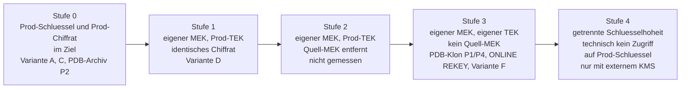

# TDE Klon-Unabhaengigkeit: Stufenmodell und Verfahren

Begleitdokument zu [tde-key-architecture.md](tde-key-architecture.md) und
[tde-restore-as-encrypted.md](tde-restore-as-encrypted.md).

Alle Messwerte in diesem Dokument stammen aus dem durchgehenden E2E-Lauf vom 2026-09-06
(Rohlog `artefacts/tde-e2e-run-20260906.log`, Faktenblatt `tasks/e2e-facts.md`), gemessen an
Oracle AI Database Free 26ai. Schluessel-IDs und gewrappte Schluesselwerte sind pro Lauf neu:
die genannten Hex-Werte belegen diesen Lauf, sie sind keine Zielwerte und in einer anderen
Umgebung nicht reproduzierbar. Reproduzierbar sind die Aussagen dahinter, nicht die Werte.

## Fragestellung und Kurzantwort

**Frage:** Wie kryptografisch unabhaengig ist eine Kopie von ihrer Quell-Datenbank,
und welche Verfahren erzielen welchen Trennungsgrad?

**Kurzantwort:** Mit einem normalen RMAN-Restore kopiert man nicht nur Daten, sondern auch
den Produktions-Keystore mit der vollstaendigen Schluesselhistorie. Der Klon ist ohne
zusaetzliche Massnahmen kryptografisch vollstaendig von der Produktion abhaengig. Neues
Tablespace-Key-Material entsteht auf drei gemessenen Wegen: dem **PDB-Klon** (lokal oder
remote ueber DB-Link), dem **`ONLINE REKEY`** und dem **Discard-Pfad** mit
`_db_discard_lost_masterkey`. Der PDB-Klon ist davon der praktisch empfohlene Weg. Kein
RMAN-Weg erneuert den Tablespace-Schluessel.

**Wichtiges Gegenbeispiel:** der PDB-Archiv-Transport (Unplug mit Key-Export, Plug-in in eine
fremde CDB) erzeugt trotz fremder CDB, eigener DBID und eigenem Keystore **keine** Trennung -
Schluessel und Chiffrat bleiben bitgenau erhalten.

## Stufenmodell

Die Stufen leiten sich aus den Labmessungen ab. Stufe 4 ist aus der OKV-Architektur
abgeleitet, nicht im Lab gemessen.



Das Stufenmodell aus `tde-key-architecture.md` (Kapitel 9) zeigt die Stufen 0 bis 3 mit
den konkreten Varianten-Bezeichnungen.

<!-- markdownlint-disable MD013 MD060 -->

| Stufe | Merkmal | Variante | Was bleibt gemeinsam | Restrisiko | Aufwand | Im Lab gemessen |
|---|---|---|---|---|---|---|
| 0 | Prod-Keystore und Prod-TEK im Ziel | A, C | MEK, TEK, Chiffrat | vollstaendige kryptografische Abhaengigkeit von Prod | minimal | ja |
| 0 | PDB-Archiv-Transport in eine fremde CDB | P2 | MEK, TEK, Chiffrat - trotz fremder CDB und eigener DBID | wie Variante A; die fremde CDB taeuscht Trennung nur vor | gering | ja |
| 1 | eigener MEK, Prod-TEK, Quell-MEK noch im Keystore | D | TEK-Klartext, identisches Chiffrat | Ciphertext-Vergleich Prod gegen Klon moeglich; Quell-MEK im Keystore | mittel | ja |
| 2 | eigener MEK, Prod-TEK, Quell-MEK aus Keystore entfernt | kein Verfahren direkt gemessen | TEK-Klartext, identisches Chiffrat | Ciphertext-Vergleich bleibt; Read-only-Tablespaces blockieren die Entfernung | mittel | nein, abgeleitet |
| 3 | eigener MEK, eigener TEK, kein Quell-MEK | P1, P4, ONLINE REKEY (G), F | nichts Schluesselrelevantes fuer die behandelten Tablespaces | Read-only-Tablespaces bleiben aussen vor; bei F: Datenfenster im Klartext und Hidden Parameter | gering (PDB-Klon), mittel (REKEY), hoch (F) | ja |
| 4 | getrennte Schluesselhoheit via externem KMS | OKV | keine | Verfuegbarkeitsabhaengigkeit vom KMS | hoch | nein, abgeleitet |

<!-- markdownlint-restore -->

## Verfahren im Detail

### Stufe 0 - Normaler RESTORE mit transportiertem Prod-Wallet

**Gemessen, Variante A.**

Ablauf: Prod-Wallet (`ewallet.p12`) und neu erzeugten `LOCAL AUTO_LOGIN`-Keystore auf den
Zielhost uebertragen, dann `RESTORE DATABASE` plus `RECOVER DATABASE` ohne zusaetzliche
Klauseln.

Ergebnis der Labmessung (Lauf 2026-09-06):

- `MASTERKEYID` unveraendert gegenueber der Quelle: `EC574AF166934D45AB5AC1F2267A297A`
- gewrappter TEK unveraendert: `059EFEB1...30F3`
- Blockvergleich: 313 von 313 Canary-Datenbloecken byteidentisch

**Was gemeinsam bleibt:** MEK, TEK, Chiffrat der Datenbloecke - alles.

`DUPLICATE ... AS ENCRYPTED` (Variante C) verhaelt sich gemessen identisch und gehoert
ebenfalls auf Stufe 0, siehe [Was nicht funktioniert](#was-nicht-funktioniert).

Nebenbefund mit Kundenrelevanz: ein `LOCAL AUTO_LOGIN`-Keystore ist hostgebunden und
oeffnet nach dem Transport nicht. Die `cwallet.sso` muss am Ziel neu erzeugt werden:

```sql
ADMINISTER KEY MANAGEMENT CREATE LOCAL AUTO_LOGIN KEYSTORE
  FROM KEYSTORE '/opt/oracle/dbconfig/FREE/wallet/tde' IDENTIFIED BY <pwd>;
```

Ausserdem zeigt `ORIGIN` fuer den transportierten Prod-Schluessel `LOCAL`, nicht `IMPORTED`
(Fall P7). Die Herkunft des Schluessels ist an den Views nicht erkennbar.

#### Entzugstest - was ohne den Quell-MEK passiert

Der Entzugstest wurde nach dem `ONLINE REKEY` gemessen und faellt deutlicher aus, als die
Formulierung "ein Tablespace ist nicht mehr lesbar" nahelegt: nach dem Entfernen des
Quell-MEK **oeffnet die Zieldatenbank nicht mehr**. Sie bleibt mit `ORA-28374` auf `MOUNTED`
stehen. Es ist also nicht ein Tablespace unlesbar, sondern die Datenbank unbrauchbar.

Fuer die Bewertung heisst das: der Quell-MEK ist keine Bequemlichkeit, die man nachtraeglich
wegnehmen kann, solange irgendein Objekt der Datenbank noch auf ihn verweist.

### Stufe 0 - PDB-Archiv-Transport in eine fremde CDB (Gegenbeispiel)

**Gemessen, Fall P2.**

Dieser Weg wird in der Praxis regelmaessig fuer eine Trennung gehalten, weil das Ergebnis in
einer anderen CDB mit eigener DBID und eigenem Keystore landet. Die Messung widerspricht dem.

Ablauf: PDB unpluggen mit `ENCRYPT USING <secret>`, Schluessel per `EXPORT KEYS` ausleiten,
im Ziel per `IMPORT KEYS` einspielen, Archiv einpluggen.

Ergebnis der Labmessung (Lauf 2026-09-06):

- `MASTERKEYID` unveraendert: `A7D954A5...347D`
- gewrappter TEK unveraendert: `FC11003A...8760` - bitgenau derselbe Wert wie in der Quelle
- Blockvergleich: 313 von 313 Canary-Datenbloecken byteidentisch
- `KEY_VERSION` nach dem Plug-in unveraendert 0 (Fall P8); der dokumentierte Reset auf 0 wurde
  nicht beobachtet, weil der Wert bereits 0 war

**Konsequenz:** eine fremde CDB erzeugt keine kryptografische Trennung. Der Archiv-Transport
verschiebt die Dateien unveraendert und transportiert die Schluessel mit. Wer eine Kopie mit
eigener Schluesselbasis will, darf diesen Weg nicht waehlen - er gehoert kryptografisch auf
dieselbe Stufe wie ein normaler RMAN-Restore.

Ohne Schluesseltransport gibt es diesen Weg gar nicht: ein Unplug ohne Key-Export wird mit
`ORA-46680` verweigert, es entsteht nicht einmal ein Archiv (Fall P3).

### Stufe 1 - Eigener MEK, gleicher TEK (Variante D)

**Gemessen, Variante D.**

Variante D erreicht Stufe 1: der MEK der Klon-Datenbank ist neu, der Tablespace-Encryption-Key
ist identisch zur Produktion - und damit ist auch das Chiffrat aller Datenbloecke identisch.

Ablauf:

1. Normaler `RESTORE DATABASE` mit transportiertem Prod-Wallet (wie Variante A)
2. `RESTORE DATABASE FORCE AS DECRYPTED` - danach `DBA_TABLESPACES.ENCRYPTED = NO` und
   `V$ENCRYPTED_TABLESPACES` leer
3. `ADMINISTER KEY MANAGEMENT SET KEY ... CONTAINER=ALL` - neuer CDB-Key; in der PDB
   separat wiederholen
4. `ALTER TABLESPACE USERS ENCRYPTION OFFLINE ENCRYPT`

Ergebnis der Labmessung (Lauf 2026-09-06):

- `MASTERKEYID` neu: `DC68C44C673F402CB782CFF2D329ADC4` statt `EC574AF1...297A`
- gewrappter TEK neu: `74D071CF...C926` statt `059EFEB1...30F3`
- Blockvergleich: 313 von 313 Canary-Datenbloecken byteidentisch zur Quelle

**Erklaerung:** `OFFLINE ENCRYPT` erzeugt keinen eigenen Tablespace-Key. Es uebernimmt den
Database Key des Containers als TEK. Da der Database Key und sein MEK im Ziel neu erzeugt
werden, ist der gewrappte TEK im Datafile-Header neu - der Schluesselklartext ist derselbe.
Das Alert-Log bestaetigt die Mechanik nach `SET KEY`:
`KZTDE: Set Master Key: Tablespace key rewrap done`.

**Restrisiko:** Das Chiffrat ist identisch zur Prod. Wer sowohl Prod- als auch Klon-Datafiles
hat, kann blockweise Existenz- und Aenderungsvergleiche ziehen, ohne zu entschluesseln.
Zusaetzlich bleibt der Quell-MEK im Keystore, solange ihn ein Objekt noch benoetigt.

### Stufe 2 - Eigener MEK, gleicher TEK, Quell-MEK entfernt

**Nicht als eigenstaendige Variante gemessen. Abgeleitet.**

Stufe 2 waere die Stufe-1-Situation, in der zusaetzlich alle Prod-MEKs aus dem
Ziel-Keystore entfernt werden. Praktische Huerde: der Quell-MEK bleibt notwendig,
solange irgendein Objekt im Klon auf ihn verweist - und der Entzugstest zeigt, dass eine
Datenbank ohne den benoetigten MEK nicht oeffnet, sondern mit `ORA-28374` auf `MOUNTED`
stehen bleibt.

Die zentrale Einschraenkung ist gemessen: **Read-only-Tablespaces ueberstehen eine
MEK-Rotation unveraendert** (Fall P5, siehe unten). Sie zeigen danach weiter auf den
Schluessel der Quelle, der alte MEK muss also im Keystore bleiben. Stufe 2 ist daher nur
erreichbar, wenn alle Read-only-Tablespaces zuvor in `READ WRITE` versetzt, neu
verschluesselt oder gedroppt wurden.

Das Chiffrat bleibt identisch zur Prod - der kryptografische Unterschied zu Stufe 1 ist
marginal. Stufe 2 ist kein sinnvolles Endziel, sondern ein Durchgangszustand auf dem
Weg zu Stufe 3.

### Stufe 3 - Eigener MEK, eigener TEK, kein Quell-MEK

**Auf drei Wegen gemessen: PDB-Klon (P1, P4), `ONLINE REKEY` (G, P6) und Discard-Pfad (F).**

Alle drei erzeugen neues Tablespace-Key-Material. Sie unterscheiden sich im Aufwand, in den
Auflagen und im Risikoprofil. Reihenfolge unten nach Praxistauglichkeit.

#### PDB-Klon - der praktisch empfohlene Weg

**Gemessen: P1 lokal in derselben CDB, P4 remote ueber DB-Link.**

Ein einziges regulaer unterstuetztes Kommando erledigt Kopie und Schluesselwechsel zugleich.
Kein Hidden Parameter, kein Datenfenster im Klartext, keine Support-Abklaerung.

Die Beweisfuehrung kommt ohne Annahmen aus: die `MASTERKEYID` ist in Quelle und Klon
**identisch**, der gewrappte Schluessel unterscheidet sich. Unter unveraendertem MEK kann ein
geaenderter gewrappter Wert kein Re-wrap sein - es muss neues Schluesselmaterial sein. Der
Blockvergleich bestaetigt es: 0 von 313 Canary-Bloecken identisch.

<!-- markdownlint-disable MD013 MD060 -->

| Fall | `MASTERKEYID` danach | Gewrappter Schluessel danach | Canary-Bloecke identisch |
|---|---|---|---|
| P1 - lokaler Klon | `A7D954A5...347D`, unveraendert | `A341ABA7...A239` statt `FC11003A...8760` | 0 von 313 |
| P4 - Remote-Klon ueber DB-Link | `A7D954A5...347D`, unveraendert | `F19A9798...E608` | 0 von 313 |

<!-- markdownlint-restore -->

Betriebliche Voraussetzung, im Lauf gemessen: jede PDB-Operation ueber verschluesselte
Tablespaces verlangt das Keystore-Passwort (`ORA-46697`) - lokaler Klon, Remote-Klon und
Einpluggen gleichermassen. Ein Auto-Login-Keystore genuegt fuer keine davon.

#### ONLINE REKEY - der dokumentierte Weg nach einem Restore

**Gemessen: Variante G in der CDB, Fall P6 in der PDB.**

`ALTER TABLESPACE <name> ENCRYPTION ONLINE REKEY` ist seit Oracle Database 12.2.0.1
dokumentiert und erzeugt nachweislich neuen TEK-Klartext. Kein Hidden Parameter, kein
Datenfenster im Klartext.

Ergebnis der Labmessung (Lauf 2026-09-06):

- Variante G: 0 von 313 Canary-Bloecken identisch, `KEY_VERSION 1 -> 2`
- Fall P6 in der PDB: 0 von 313 identisch, gewrappter Schluessel `9D876AE7...6C87`,
  `KEY_VERSION 0 -> 1`

Lizenzhinweis: `ONLINE REKEY` ist in Oracle Database Free 26ai technisch durchgelaufen. Die
Verfuegbarkeit in der eingesetzten Edition ist eine Lizenz- und Supportfrage, kein technischer
Riegel. Fuer den Produktionseinsatz ist eine gueltige Enterprise Edition mit Advanced Security
Option erforderlich.

Ein per `OFFLINE ENCRYPT` verschluesselter Tablespace, der den Database Key als TEK verwendet,
kann direkt mit `ONLINE REKEY` behandelt werden; dabei entsteht ein eigener Schluessel.

#### Variante F - Discard-Pfad mit `_db_discard_lost_masterkey`

**Gemessen. Funktioniert, verlangt aber Hidden Parameter und Support-Freigabe.**

Ablauf:

1. `RESTORE DATABASE` plus `RECOVER DATABASE` mit transportiertem Prod-Wallet
2. `ALTER TABLESPACE USERS ENCRYPTION OFFLINE DECRYPT`
   Vor dem naechsten Schritt zwingend pruefen:
   `SELECT COUNT(*) FROM containers(v$encrypted_tablespaces)` muss 0 liefern.
3. Undo-Tablespace austauschen - siehe Auflagen unten
4. Keystore-Verzeichnis beiseite legen, frischen Keystore anlegen und oeffnen:

    ```sql
    ADMINISTER KEY MANAGEMENT CREATE KEYSTORE IDENTIFIED BY <pwd>;
    ADMINISTER KEY MANAGEMENT SET KEYSTORE OPEN IDENTIFIED BY <pwd>;
    ADMINISTER KEY MANAGEMENT SET KEY IDENTIFIED BY <pwd> WITH BACKUP CONTAINER=ALL;
    ```

5. In der PDB: `ALTER SYSTEM SET "_db_discard_lost_masterkey"=TRUE SCOPE=MEMORY`
6. In der PDB: `ADMINISTER KEY MANAGEMENT SET KEY FORCE KEYSTORE IDENTIFIED BY <pwd> WITH BACKUP`
7. `ALTER TABLESPACE USERS ENCRYPTION OFFLINE ENCRYPT`

Ergebnis der Labmessung (Lauf 2026-09-06):

- `MASTERKEYID` neu: `C7A38A0C...74A3`
- gewrappter Schluessel neu: `A0BB56AF...E2AC`
- Blockvergleich: 0 von 313 Canary-Bloecken identisch - neues Schluesselmaterial

Auflagen, die zwingend in jede Dokumentation und Praesentation gehoeren:

- `_db_discard_lost_masterkey` ist ein Hidden Parameter, in einer MOS Note dokumentiert.
  Einsatz nur nach Abklaerung mit Oracle Support.
- Der Parameter muss in der PDB gesetzt werden. Auf CDB-Ebene wirkt er nicht.
- Fachlich zulaessig ausschliesslich nach vollstaendigem `OFFLINE DECRYPT`, wenn
  `containers(v$encrypted_tablespaces)` 0 Zeilen liefert. Das ist Vorbedingung, keine Option.
- **Verschluesseltes Undo bricht den Pfad.** Die Bedingung "nichts mehr verschluesselt"
  schliesst Undo ein, und `V$ENCRYPTED_TABLESPACES` zeigt Undo nicht an. Im Lauf meldete die
  View nach `OFFLINE DECRYPT` korrekt 0 Zeilen, die Undo-Saetze aus der Zeit davor hingen aber
  weiter am Quellschluessel. Nach dem Keystore-Austausch scheiterte die naechste Operation mit
  `ORA-28304` auf dem **Undo-Datafile**. Wer diesen Weg geht, muss vor dem Discard das
  Undo-Tablespace austauschen, nicht nur die Daten-Tablespaces entschluesseln.
- Im Fenster zwischen Schritt 2 und Schritt 7 liegen die Daten unverschluesselt. Das ist ein
  bewusster Sicherheitskompromiss, der im Betrieb bewertet werden muss.
- Eine Sekundaerquelle (asanga-pradeep-Blog) warnt bei wiederholtem Einsatz vor echten
  Korruptionen und einer Alert-Log-Warnung zu einem ersetzten SYSAUX-Key.
- Gemessen in Oracle AI Database Free 26ai. Nicht in Enterprise Edition getestet.

#### Einschraenkung fuer alle drei Wege: Read-only-Tablespaces

**Gemessen, Fall P5.**

Read-only-Tablespaces ueberstehen eine MEK-Rotation unveraendert und bleiben an den
Quellschluessel gebunden. Sie koennen nicht neu eingewickelt werden, weil Oracle den
Datafile-Header nicht beschreiben kann.

<!-- markdownlint-disable MD013 MD060 -->

| Fall | `MASTERKEYID` danach | Gewrappter Schluessel | Canary-Bloecke identisch | Aussage |
|---|---|---|---|---|
| P5 - MEK-Rotation, Tablespace `READ ONLY` | Tablespace zeigt weiter auf `A7D954A5...347D` | unveraendert | 313 von 313 | bleibt an den Quellschluessel gebunden |
| P5 - MEK-Rotation, Tablespace `READ WRITE` | `EFDFB56C...DC5F` | `3BA00862...AC36` | 313 von 313 | Re-wrap, Chiffrat unveraendert |

<!-- markdownlint-restore -->

**Konsequenz:** wer eine Stufe ueber eine MEK-Rotation erreichen will, erreicht sie fuer
read-only Tablespaces nicht. Der alte Produktionsschluessel muss dann im Keystore bleiben,
sonst sind die Daten unlesbar - und die Datenbank oeffnet nicht. In grossen Umgebungen ist das
der Normalfall: historische Partitionen, abgeschlossene Geschaeftsjahre, archivierte Mandanten.

Die Einschraenkung betrifft Stufe 2 und Stufe 3 gleichermassen, soweit der jeweilige Weg auf
einer Rotation oder einem Rekey des betroffenen Tablespace beruht. Vor einem solchen Vorgehen
gehoert eine Inventur der read-only Tablespaces in die Planung.

### Stufe 4 - Getrennte Schluesselhoheit (OKV)

**Nicht im Lab gemessen. Abgeleitet aus OKV-Architekturdokumentation.**

Stufe 3 stellt sicher, dass der Klon keinen Prod-Schluessel enthaelt. Stufe 4 geht weiter:
der Non-Prod-Betrieb kann technisch nicht an Prod-Schluessel gelangen, weil die Schluessel
nicht in einer Datei liegen, die kopiert werden koennte.

Oracle Key Vault (OKV) erreicht das ueber Virtual Wallets und Endpoint Groups. Jedem
Endpoint (hier: jeder Datenbank) koennen eigene Wallets zugewiesen werden, mit den Rechten
Read Only, Read and Modify oder Manage Wallet. Der Prod-Endpoint bekommt keinen Zugriff auf
den Non-Prod-Wallet und umgekehrt. Ein Entzug ist jederzeit moeglich.

Belegt: "Managing keys in Oracle Key Vault mitigates risks associated with disk-based private
keys, including key theft, unauthorized copying and sharing of keys, and key loss."
Quelle: OKV Administration Guide 21.11.

Nicht belegt: ein von Oracle dediziert dokumentiertes Prod/Non-Prod-Klon-Muster. Die
Konstrukte sind belegt, das Muster ist aus der Architektur ableitbar.

Ein Nebenbefund aus dem Lauf stuetzt Stufe 4 unabhaengig von der Klonfrage: ein per
`EXPORT`/`IMPORT KEYS` aus der Produktion transportierter Schluessel meldet im Ziel
`ORIGIN = LOCAL` (Fall P7). Nichts in `V$ENCRYPTION_KEYS` unterscheidet ihn von einem vor Ort
erzeugten. Die Frage "woher stammt dieser Schluessel" laesst sich mit einem Software-Keystore
nicht beantworten.

Ausfuehrliche Behandlung in [tde-okv-argumentation.md](tde-okv-argumentation.md).

## Empfehlung und Entscheidungshilfe

**Reihenfolge:**

1. **PDB-Klon**, lokal oder remote ueber DB-Link. Ein regulaer unterstuetztes Kommando, das
   Kopie und Schluesselwechsel in einem Schritt erledigt. Erste Wahl, wo die Quelle als PDB
   vorliegt.
2. **`ONLINE REKEY`** nach dem Restore, wenn der RMAN-Weg gesetzt ist und eine gueltige EE mit
   Advanced Security Option vorliegt.
3. **Variante F**, wenn Stufe 3 erforderlich ist und weder PDB-Klon noch `ONLINE REKEY` zur
   Verfuegung stehen - mit vollstaendiger Umsetzung der Auflagen, Austausch des
   Undo-Tablespace und nach Abklaerung mit dem Oracle Support.
4. Wenn Stufe 3 nicht erreichbar ist und Stufe 1 genuegt: Variante D, mit Verstaendnis
   des Restrisikos (identisches Chiffrat, Ciphertext-Vergleich moeglich).
5. Fuer durchgehend getrennte Schluesselhoheit ueber mehrere Klon-Zyklen: OKV (Stufe 4).

**Nicht waehlen**, wer Trennung will: den PDB-Archiv-Transport. Er sieht nach Trennung aus
(fremde CDB, eigene DBID, eigener Keystore) und erhaelt Schluessel wie Chiffrat vollstaendig.

**Entscheidungshilfe nach Schutzanforderung:**

<!-- markdownlint-disable MD013 MD060 -->

| Anforderung | Minimale Stufe | Begruendung |
|---|---|---|
| Klon fuer interne Entwicklung, keine regulatorischen Vorgaben | Stufe 1 | Prod-MEK nicht im Klon, kein direkter Datenzugriff ohne Quell-Backup |
| Weitergabe des Klons an externe Dienstleister oder andere Umgebungen | Stufe 3 | Identisches Chiffrat bei Stufe 1 erlaubt Rueckschluesse auf Datenaenderungen |
| Regulatory Compliance, Trennung Prod/Non-Prod in Audit-Scope | Stufe 3 oder 4 | Nachweisbarkeit der kryptografischen Trennung, kein gemeinsames Schluesselmaterial |
| Mehrere Klon-Zyklen, Prod-Keystore darf Non-Prod nie beruehren | Stufe 4 | Verfahrenskontrolle durch technische Durchsetzung statt manuelle Prozesse |

<!-- markdownlint-restore -->

Stufe 0 ist kein akzeptables Ziel fuer irgendeinen Produktionsklon, der nicht unmittelbar
auf demselben System als Hot-Spare betrieben wird.

## Was nicht funktioniert

Alle Fehlwege gemessen, nicht hergeleitet.

**`RESTORE ... AS ENCRYPTED USING KEY` mit Prod-MEK im Ziel (`ORA-00600`):**
Die unverschluesselten CDB-Datafiles werden konvertiert. Sobald RMAN das bereits
verschluesselte Datafile erreicht, bricht der Lauf mit
`ORA-00600 [kcbtse_encdec_tbsblk_1]` ab. Ursache: `AS ENCRYPTED` versucht, bereits
verschluesselte Bloecke erneut zu verschluesseln - das ist nicht vorgesehen. Fuer eine
bereits verschluesselte Quelle ist der Weg nicht nutzbar.

**`RESTORE ... AS ENCRYPTED USING KEY` ohne Prod-MEK (`ORA-19870` plus `ORA-28374`):**
Scheitert sofort beim ersten Backup-Piece. RMAN braucht den Quell-MEK, um die
verschluesselten Quellbloecke zu lesen. Ein RMAN-Klon ohne Transfer des Prod-Schluessels
existiert nicht.

**`DUPLICATE ... AS ENCRYPTED` (Schluessel bleibt):**
Variante C laeuft durch, `MASTERKEYID` und gewrappter Schluessel bleiben unveraendert,
313 von 313 Canary-Bloecke sind identisch. Kryptografisch ist das Ergebnis dasselbe wie
Variante A. Der Doku-Wortlaut "tablespaces that are not encrypted" benennt den Anwendungsfall
praezise - fuer bereits verschluesselte Tablespaces ist kein Schluesselwechsel belegt.

**PDB-Unplug ohne Key-Export (`ORA-46680`):**
Oracle verweigert das Unplug, es entsteht nicht einmal ein Archiv. Ohne Schluesseltransport
gibt es keinen Archiv-Weg.

**Reine MEK-Rotation (nur Rewrap):**
`ADMINISTER KEY MANAGEMENT SET KEY` ersetzt den MEK und wickelt alle TEKs neu ein. Das
Chiffrat der Datenbloecke aendert sich nicht: 313 von 313 Canary-Bloecke identisch (Fall P5,
`READ WRITE`). Alert-Log-Beleg: `KZTDE: Set Master Key: Tablespace key rewrap done`. Fuer
read-only Tablespaces findet nicht einmal der Rewrap statt.

**`OFFLINE DECRYPT` plus `OFFLINE ENCRYPT` allein (Schluesselklartext bleibt):**
Variante D ohne Keystore-Wechsel. Der TEK-Klartext uebersteht den Konvertierungszyklus, weil
`OFFLINE ENCRYPT` den Database Key des Containers uebernimmt statt einen eigenen Schluessel zu
erzeugen. Ergebnis: 313 von 313 Canary-Datenbloecke byteidentisch.

**Algorithmuswechsel mit der `ENCRYPT`-Klausel (`ORA-28340`):**
`ALTER TABLESPACE ... ENCRYPTION OFFLINE USING 'AES192' ENCRYPT` scheitert mit
`ORA-28340`. Ursache ist das falsche Kommando, keine Sperre: die `ENCRYPT`-Klausel nimmt
keinen Algorithmus an, weil beim ersten Mal mit dem bestehenden Database Key verschluesselt
wird. Fuer einen Algorithmuswechsel ist die `REKEY`-Klausel zu verwenden. Details und Messung
in [tde-restore-as-encrypted.md](tde-restore-as-encrypted.md), Abschnitt
"Algorithmuswechsel als Beweis fuer neues Schluesselmaterial".

## Quellen

**Messgrundlage:**

- Faktenblatt zum E2E-Lauf vom 2026-09-06: `tasks/e2e-facts.md`
- Rohlog: `artefacts/tde-e2e-run-20260906.log`
- Protokoll: [tde-e2e-protokoll.md](tde-e2e-protokoll.md)

**Oracle-Primaerquellen:**

- Oracle Backup and Recovery Reference 19c, RESTORE:
  <https://docs.oracle.com/en/database/oracle/oracle-database/19/rcmrf/RESTORE.html>
- Oracle Backup and Recovery Reference 26ai, RESTORE:
  <https://docs.oracle.com/en/database/oracle/oracle-database/26/rcmrf/RESTORE.html>
- Oracle Backup and Recovery Reference 19c, DUPLICATE:
  <https://docs.oracle.com/en/database/oracle/oracle-database/19/rcmrf/DUPLICATE.html>
- Oracle TDE 26ai, Encryption Conversions for Tablespaces:
  <https://docs.oracle.com/en/database/oracle/oracle-database/26/dbtde/encryption-conversions-tablespaces-and-databases1.html>
- Oracle TDE 26ai, Administering United Mode:
  <https://docs.oracle.com/en/database/oracle/oracle-database/26/dbtde/administering-united-mode1.html>
- Oracle Advanced Security 19c, FAQ TDE:
  <https://docs.oracle.com/en/database/oracle/oracle-database/19/asoag/frequently-asked-questions-about-transparent-data-encryption.html>
- Oracle Reference 19c, V$ENCRYPTED_TABLESPACES:
  <https://docs.oracle.com/en/database/oracle/oracle-database/19/refrn/V-ENCRYPTED_TABLESPACES.html>
- Oracle Reference 21c, V$ENCRYPTION_KEYS:
  <https://docs.oracle.com/en/database/oracle/oracle-database/21/refrn/V-ENCRYPTION_KEYS.html>
- Oracle TDE 26ai, ORA-28374:
  <https://docs.oracle.com/en/database/oracle/oracle-database/26/dbtde/error-ora-28374-typed-master-key-not-found.html>
- Oracle Database Free 26ai, Licensing Restrictions:
  <https://docs.oracle.com/en/database/oracle/oracle-database/26/xeinl/licensing-restrictions.html>

**Sekundaerquelle:**

- Asanga Pradeep Blog, 19c Encryption (Sekundaerquelle, MOS-Note-Nummern nicht
  unabhaengig verifiziert):
  <https://asanga-pradeep.blogspot.com/2019/10/19c-encryption.html>
