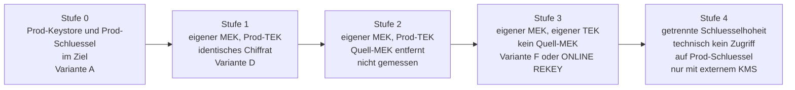

# TDE Klon-Unabhaengigkeit: Stufenmodell und Verfahren

Begleitdokument zu [tde-key-architecture.md](tde-key-architecture.md) und
[tde-restore-as-encrypted.md](tde-restore-as-encrypted.md).
Alle Messwerte an Oracle AI Database Free 26ai, Services `odbencprod` und
`odbencdev`, PDB `ODBENCPROD`, Tablespace `USERS`.

## Fragestellung und Kurzantwort

**Frage:** Wie kryptografisch unabhaengig ist ein Klon von seiner Quell-Datenbank,
und welche Verfahren erzielen welchen Trennungsgrad?

**Kurzantwort:** Mit einem normalen RMAN-Restore kopiert man nicht nur Daten, sondern auch
den Produktions-Keystore mit der vollstaendigen Schluesselhistorie. Der Klon ist ohne
zusaetzliche Massnahmen kryptografisch vollstaendig von der Produktion abhaengig. Die
einzigen Wege zu echtem neuem Tablespace-Key-Material sind `ONLINE REKEY` und Variante F
(OFFLINE DECRYPT, frischer Keystore, `_db_discard_lost_masterkey`, OFFLINE ENCRYPT).
Alle anderen RMAN-Operationen erhalten den bestehenden Tablespace-Encryption-Key.

## Stufenmodell

Die vier Stufen leiten sich ausschliesslich aus den Labmessungen ab. Stufe 4 ist aus der
OKV-Architektur abgeleitet, nicht im Lab gemessen.



Das Stufenmodell aus `tde-key-architecture.md` (Kapitel 9) zeigt die Stufen 0 bis 3 mit
den konkreten Varianten-Bezeichnungen.

<!-- markdownlint-disable MD013 MD060 -->

| Stufe | Merkmal | Variante | Was bleibt gemeinsam | Restrisiko | Aufwand | Im Lab gemessen |
|---|---|---|---|---|---|---|
| 0 | Prod-Keystore und Prod-TEK im Ziel | A | MEK, TEK, Chiffrat | vollstaendige kryptografische Abhaengigkeit von Prod | minimal | ja |
| 1 | eigener MEK, Prod-TEK, Quell-MEK noch im Keystore | D | TEK-Klartext, identisches Chiffrat | Ciphertext-Vergleich Prod gegen Klon moeglich; Quell-MEK im Keystore | mittel | ja |
| 2 | eigener MEK, Prod-TEK, Quell-MEK aus Keystore entfernt | kein Verfahren direkt gemessen | TEK-Klartext, identisches Chiffrat | Ciphertext-Vergleich bleibt; praktische Huerde: Read-only-Tablespaces blockieren Entfernung | mittel | nein, abgeleitet |
| 3 | eigener MEK, eigener TEK, kein Quell-MEK | F, ONLINE REKEY | nichts Schluesselrelevantes | bei F: Datenfenster im Klartext; Hidden Parameter mit Auflagen | hoch (F), mittel (REKEY) | ja |
| 4 | getrennte Schluesselhoheit via externem KMS | OKV | keine | Verfuegbarkeitsabhaengigkeit vom KMS | hoch | nein, abgeleitet |

<!-- markdownlint-restore -->

## Verfahren im Detail

### Stufe 0 - Normaler RESTORE mit transportiertem Prod-Wallet

**Gemessen, Variante A.**

Ablauf: Prod-Wallet (`ewallet.p12`) und neu erzeugten `LOCAL AUTO_LOGIN`-Keystore auf den
Zielhost uebertragen, dann `RESTORE DATABASE` plus `RECOVER DATABASE` ohne zusaetzliche
Klauseln.

Ergebnis der Labmessung:

- MASTERKEYID identisch zur Prod: `8A27589796A248BE95222E59407FF962`
- gewrappter TEK identisch: `BAD537AD...AFA55`
- Blockvergleich: 313 von 313 Canary-Datenbloecken byteidentisch
- Entzugstest: nach Zurueckspielen des eigenen Dev-Wallets scheitert `SELECT` auf die
  Canary-Tabelle mit `ORA-28374: typed master key not found in wallet`

**Was gemeinsam bleibt:** MEK, TEK, Chiffrat der Datenbloecke - alles.

Nebenbefund mit Kundenrelevanz: ein `LOCAL AUTO_LOGIN`-Keystore ist hostsgebunden und
oeffnet nach dem Transport nicht. `v$encryption_wallet` zeigt `CLOSED / WALLET_TYPE UNKNOWN`,
der Zugriff scheitert mit `ORA-28365`. Die `cwallet.sso` muss am Ziel neu erzeugt werden:

```sql
ADMINISTER KEY MANAGEMENT CREATE LOCAL AUTO_LOGIN KEYSTORE
  FROM KEYSTORE '/opt/oracle/dbconfig/FREE/wallet/tde' IDENTIFIED BY <pwd>;
```

Ausserdem zeigt `ORIGIN` fuer den transportierten Prod-Schluessel `LOCAL`, nicht `IMPORTED`.
Die Herkunft des Schluessels ist an den Views nicht erkennbar.

### Stufe 1 - Eigener MEK, gleicher TEK (Variante D)

**Gemessen, Variante D.**

Variante D erreicht Stufe 1: der MEK der Klon-Datenbank ist neu, der Tablespace-Encryption-Key
ist identisch zur Produktion - und damit ist auch das Chiffrat aller Datenbloecke identisch.

Ablauf:

1. Normaler `RESTORE DATABASE` mit transportiertem Prod-Wallet (wie Variante A)
2. `RESTORE DATABASE FORCE AS DECRYPTED` - danach `DBA_TABLESPACES.ENCRYPTED = NO`,
   `V$ENCRYPTED_TABLESPACES` leer, Canary im Klartext im Datafile auffindbar (313 Treffer)
3. `ADMINISTER KEY MANAGEMENT SET KEY ... CONTAINER=ALL` - neuer CDB-Key; in der PDB
   separat wiederholen (ORA-46663 aus CDB heraus wegen `PDB$SEED`)
4. `ALTER TABLESPACE USERS ENCRYPTION OFFLINE ENCRYPT`

Kernergebnis: die 313 Canary-Datenbloecke sind nach diesem Durchlauf **byteidentisch zur Prod**.
Das gilt selbst bei wiederholtem DECRYPT-ENCRYPT-Zyklus (KEY_VERSION steigt, TEK-Klartext bleibt).

**Erklaerung:** `OFFLINE ENCRYPT` erzeugt keinen eigenen Tablespace-Key. Es uebernimmt den
Database Key des Containers als TEK. Da der Database Key und sein MEK im Ziel neu erzeugt werden,
ist der gewrappte TEK im Datafile-Header neu - der eigentliche Schluesselklartext ist derselbe.
Das Alert-Log bestaetigt die Mechanik nach `SET KEY`: `KZTDE: Set Master Key: Tablespace key rewrap done`.

**Restrisiko:** Das Chiffrat ist identisch zur Prod. Ein Angreifer, der sowohl Prod- als auch
Klon-Datafiles hat, kann blockweise Existenz- und Aenderungsvergleiche ziehen, ohne zu
entschluesseln. Zusaetzlich bleibt der Quell-MEK im Keystore, solange er fuer andere Objekte
(SYSTEM, SYSAUX, Read-only-Tablespaces) noch benoetigt wird.

### Stufe 2 - Eigener MEK, gleicher TEK, Quell-MEK entfernt

**Nicht als eigenstaendige Variante gemessen. Abgeleitet.**

Stufe 2 waere die Stufe-1-Situation, in der zusaetzlich alle Prod-MEKs aus dem
Ziel-Keystore entfernt werden. Praktische Huerde: der Quell-MEK bleibt notwendig,
solange irgendein Objekt im Klon auf ihn verweist. Gemessen wurde, dass
Read-only-Tablespaces bei einer MEK-Rotation nicht umgewickelt werden koennen, weil
Oracle den Datafile-Header nicht beschreiben kann. Der alte MEK bleibt dann zwingend
erforderlich. Stufe 2 ist daher nur erreichbar, wenn alle Read-only-Tablespaces
entweder in READ WRITE versetzt, neu verschluesselt oder gedroppt wurden.

Das Chiffrat bleibt identisch zur Prod - der kryptografische Unterschied zu Stufe 1 ist
marginal. Stufe 2 ist kein sinnvolles Endziel, sondern ein Durchgangszustand auf dem
Weg zu Stufe 3.

### Stufe 3 - Eigener MEK, eigener TEK, kein Quell-MEK

**Gemessen: Variante F und ONLINE REKEY (Variante G).**

Beide Wege erzeugen neues Tablespace-Key-Material. Sie unterscheiden sich in den Auflagen,
im Risikoprofil und im Datenfenster.

#### Variante F - RESTORE, DECRYPT, frischer Keystore, SET KEY, ENCRYPT

Ablauf, reproduzierbar gemessen:

1. `RESTORE DATABASE` plus `RECOVER DATABASE` mit transportiertem Prod-Wallet
2. `ALTER TABLESPACE USERS ENCRYPTION OFFLINE DECRYPT`
   Vor dem naechsten Schritt zwingend pruefen: `SELECT COUNT(*) FROM containers(v$encrypted_tablespaces)`
   muss 0 liefern. Erst dann ist die Vorbedingung erfuellt.
3. Keystore-Verzeichnis beiseite legen, frischen Keystore anlegen und oeffnen:

    ```sql
    ADMINISTER KEY MANAGEMENT CREATE KEYSTORE IDENTIFIED BY <pwd>;
    ADMINISTER KEY MANAGEMENT SET KEYSTORE OPEN IDENTIFIED BY <pwd>;
    ADMINISTER KEY MANAGEMENT SET KEY IDENTIFIED BY <pwd> WITH BACKUP CONTAINER=ALL;
    ```

4. In der PDB: `ALTER SYSTEM SET "_db_discard_lost_masterkey"=TRUE SCOPE=MEMORY`
5. In der PDB: `ADMINISTER KEY MANAGEMENT SET KEY FORCE KEYSTORE IDENTIFIED BY <pwd> WITH BACKUP`
6. `ALTER TABLESPACE USERS ENCRYPTION OFFLINE ENCRYPT`

Auflagen, die zwingend in jede Dokumentation und Praesentation gehoeren:

- `_db_discard_lost_masterkey` ist ein Hidden Parameter, in einer MOS Note dokumentiert.
  Einsatz nur nach Abklaerung mit Oracle Support. Oeffentlich nicht belegte Oracle-Freigabe.
- Der Parameter muss in der PDB gesetzt werden (`ISPDB_MODIFIABLE TRUE`). Auf CDB-Ebene
  scheitert `SCOPE=MEMORY` mit ORA-02097 plus ORA-28355, und `SCOPE=SPFILE` plus Neustart
  wirkt nicht - der Laufzeitwert bleibt FALSE.
- Fachlich zulaessig ausschliesslich nach vollstaendigem `OFFLINE DECRYPT`, wenn
  `containers(v$encrypted_tablespaces)` 0 Zeilen liefert. Das ist Vorbedingung, keine Option.
- Im Fenster zwischen Schritt 2 und Schritt 6 liegen die Daten unverschluesselt. Das ist
  ein bewusster Sicherheitskompromiss, der im Betrieb bewertet werden muss.
- Eine Sekundaerquelle (asanga-pradeep-Blog) warnt bei wiederholtem Einsatz vor echten
  Korruptionen (ORA-01595, ORA-28304) und einer Alert-Log-Warnung zu einem ersetzten
  SYSAUX-Key.
- Gemessen in Oracle AI Database Free 26ai. Nicht in Enterprise Edition getestet.

Ergebnis der Labmessung (Variante F, Gruene-Wiese-Lauf):

<!-- markdownlint-disable MD013 MD060 -->

| Pruefung | Wert |
|---|---|
| Quell-MEKs im Keystore | 0 |
| MEKs im Keystore | 5, alle ORIGIN LOCAL, im Ziel erzeugt |
| PDB Database Key | B0A4B54D...0B74 (vorher: 01D00DF6...8F98 aus Prod) |
| TEK USERS | D40B030F...F03F (vorher: E36623EC...934F aus Prod) |
| KEY_VERSION | 3 |
| Quell-TEK im Datafile-Header | 0 Treffer |
| Quell-MASTERKEYID im Header | 0 Treffer |
| Blockvergleich gegen Quelle | 2561 von 2561 Bloecken unterschiedlich |
| Canary-Datenbloecke | 313 von 313 unterschiedlich |
| Canary lesbar | 5000 Zeilen, 5000 Marker-Treffer |
| open_mode | READ WRITE ohne jeden Quell-Schluessel |

<!-- markdownlint-restore -->

Der Entzugstest ist implizit bestanden: die Quell-MEKs existieren im Ziel-Keystore nicht
mehr, die Datenbank laeuft.

Hinweis zur Mechanik: `OFFLINE ENCRYPT` uebernimmt den Database Key als TEK. Da der
Database Key in Variante F frisch erzeugt wurde (neuer Keystore), ist der resultierende
TEK vollstaendig neu - auch wenn `OFFLINE ENCRYPT` selbst keinen eigenen Schluessel
generiert.

#### ONLINE REKEY - der saubere, dokumentierte Weg

**Gemessen (Variante G).**

`ALTER TABLESPACE <name> ENCRYPTION ONLINE REKEY` ist seit Oracle Database 12.2.0.1
dokumentiert und erzeugt nachweislich neuen TEK-Klartext. Es gibt keinen Hidden Parameter,
kein Datenfenster im Klartext und keine Sekundaerquelle-Warnung zu Korruptionen.

Ergebnis der Labmessung (Variante G):

- KEY_VERSION: 3 auf 4
- TEK: `D40B030F...F03F` auf `A4C84E43...426B`
- neues Datafile angelegt, altes physisch entfernt
- alte TEKs im neuen Datafile nicht mehr auffindbar
- 2560 von 2561 Bloecken unterschiedlich (nur Block 0, der OS-Dateikopf, bleibt gleich)

Lizenzhinweis: `ONLINE REKEY` wurde in Oracle Database Free 26ai technisch ausgefuehrt.
Die Licensing Restriction ist eine Lizenz- und Supportaussage, kein technischer Riegel.
Fuer Produktionseinsatz ist eine gueltige Enterprise Edition Advanced Security Option-Lizenz
erforderlich.

`ONLINE REKEY` setzt ausserdem voraus, dass der Tablespace einen eigenen Schluessel hat
(erzeugt durch `ONLINE ENCRYPT` oder `ONLINE REKEY`). Ein per `OFFLINE ENCRYPT`
verschluesselter Tablespace, der den Database Key als TEK verwendet, kann direkt mit
`ONLINE REKEY` behandelt werden; in diesem Fall wird ein neuer eigener Schluessel erzeugt.

### Stufe 4 - Getrennte Schluesselhoheit (OKV)

**Nicht im Lab gemessen. Abgeleitet aus OKV-Architekturdokumentation.**

Stufe 3 stellt sicher, dass der Klon keinen Prod-Schluessel enthaelt. Stufe 4 geht weiter:
der Non-Prod-Betrieb kann technisch nicht an Prod-Schluessel gelangen, weil die Schluessel
nicht in einer Datei liegen, die kopiert werden koennte.

Oracle Key Vault (OKV) erreicht das ueber Virtual Wallets und Endpoint Groups. Jedem
Endpoint (hier: jeder Datenbank) koennen eigene Wallets zugewiesen werden, mit den Rechten
Read Only, Read and Modify oder Manage Wallet. Der Prod-Endpoint bekommt keinen Zugriff auf
den Non-Prod-Wallet und umgekehrt. Ein Entzug ist jederzeit moeglich.

Belegt: "Managing keys in Oracle Key Vault mitigates risks associated with disk-based private
keys, including key theft, unauthorized copying and sharing of keys, and key loss."
Quelle: OKV Administration Guide 21.11.

Nicht belegt: ein von Oracle dediziert dokumentiertes Prod/Non-Prod-Klon-Muster. Die
Konstrukte sind belegt, das Muster ist aus der Architektur ableitbar.

Ausfuehrliche Behandlung in [tde-okv-argumentation.md](tde-okv-argumentation.md).

## Empfehlung und Entscheidungshilfe

**Reihenfolge:**

1. Wenn eine gueltige EE Advanced Security Option-Lizenz vorliegt: `ONLINE REKEY` nach
   dem Klon. Sauber, dokumentiert, kein Datenfenster, kein Hidden Parameter.
2. Wenn nur Oracle Free oder Standard Edition vorliegt und Stufe 3 erforderlich ist:
   Variante F - mit vollstaendiger Umsetzung der Auflagen und nach Abklaerung mit dem
   Oracle Support.
3. Wenn Stufe 3 nicht erreichbar ist und Stufe 1 genuegt: Variante D, mit Verstaendnis
   des Restrisikos (identisches Chiffrat, Ciphertext-Vergleich moeglich).
4. Fuer durchgehend getrennte Schluesselhoheit ueber mehrere Klon-Zyklen: OKV (Stufe 4).

**Entscheidungshilfe nach Schutzanforderung:**

<!-- markdownlint-disable MD013 MD060 -->

| Anforderung | Minimale Stufe | Begruendung |
|---|---|---|
| Klon fuer interne Entwicklung, keine regulatorischen Vorgaben | Stufe 1 | Prod-MEK nicht im Klon, kein direkter Datenzugriff ohne Quell-Backup |
| Weitergabe des Klons an externe Dienstleister oder andere Umgebungen | Stufe 3 | Identisches Chiffrat bei Stufe 1 erlaubt Rueckschluesse auf Datenaenderungen |
| Regulatory Compliance, Trennung Prod/Non-Prod in Audit-Scope | Stufe 3 oder 4 | Nachweisbarkeit der kryptografischen Trennung, kein gemeinsames Schluesselimaterial |
| Mehrere Klon-Zyklen, Prod-Keystore darf Non-Prod nie beruehren | Stufe 4 | Verfahrenskontrolle durch technische Durchsetzung statt manuelle Prozesse |

<!-- markdownlint-restore -->

Stufe 0 ist kein akzeptables Ziel fuer irgendeinen Produktionsklon, der nicht unmittelbar
auf demselben System als Hot-Spare betrieben wird.

## Was nicht funktioniert

Alle Fehlwege gemessen, nicht hergeleitet.

**AS ENCRYPTED bei verschluesselter Quelle (ORA-00600):**
`RESTORE DATABASE AS ENCRYPTED USING KEY '<dev_mek>'` mit Prod-MEK im Ziel-Keystore.
Die unverschluesselten CDB-Datafiles wurden in 5:45 erfolgreich konvertiert. Sobald RMAN
das bereits verschluesselte Datafile 20 erreicht: `ORA-00600 [kcbtse_encdec_tbsblk_1], [4], [2], [806], [18], [806], [20]`.
Dreimal deterministisch reproduziert. Ursache: AS ENCRYPTED versucht, bereits verschluesselte
Bloecke erneut zu verschluesseln - das ist nicht vorgesehen.

**AS ENCRYPTED ohne Quell-MEK (ORA-19870 plus ORA-28374):**
`RESTORE DATABASE AS ENCRYPTED USING KEY '<dev_mek>'` ohne Prod-MEK im Ziel-Keystore.
Scheitert sofort: `ORA-19870: error while restoring backup piece`, `ORA-28374: typed master
key not found in wallet`. RMAN braucht den Quell-MEK, um die verschluesselten Quellbloecke
zu lesen. Ein RMAN-Klon ohne Transfer des Prod-Schluessels existiert nicht.

**DUPLICATE AS ENCRYPTED (TEK bleibt):**
Variante C laeuft durch und erzeugt eine eigenstaendige Datenbank mit neuer DBID. Der bereits
verschluesselte USERS-Tablespace behaelt seinen Original-TEK aus der Quelle
(`E36623EC...934F`). Die zuvor unverschluesselten Tablespaces erhalten den Database Key der
Quell-PDB (`566B2C9C...69CE`), kein neues Schluesselmaterial. Kryptografisch ist das Ergebnis
dasselbe wie Variante A. Der Doku-Wortlaut "tablespaces that are not encrypted" benennt den
Anwendungsfall praezise - fuer bereits verschluesselte Tablespaces ist kein TEK-Wechsel belegt.

**OFFLINE DECRYPT plus OFFLINE ENCRYPT allein (TEK bleibt):**
Variante D ohne Keystore-Wechsel. Der TEK-Klartext uebersteht den Konvertierungszyklus.
Gemessen: KEY_VERSION steigt (3, dann 5), gewrappter TEK unveraendert (`8FBDA2A8...3E41`),
313 von 313 Canary-Datenbloecken byteidentisch. Grund: der gewrappte TEK bleibt nach DECRYPT
physisch im Datafile-Header (Offset 8977, Block 1 Byte 785). OFFLINE DECRYPT raeumt die
Datenbloecke, nicht den Schluessel-Handle.

**Reine MEK-Rotation (nur Rewrap):**
`ADMINISTER KEY MANAGEMENT SET KEY` ersetzt den MEK und wickelt alle TEKs neu ein. Das
Chiffrat der Datenbloecke aendert sich nicht. Alert-Log-Beleg: `KZTDE: Set Master Key:
Tablespace key rewrap done`. Blockvergleich: 2560 von 2561 Bloecken identisch.

**Algorithmuswechsel auf bestehendem Tablespace (ORA-28340):**
`ALTER TABLESPACE USERS ENCRYPTION OFFLINE USING 'AES192' ENCRYPT` scheitert mit
`ORA-28340: A different encryption algorithm has been chosen for the table or tablespace`,
auch nach vollstaendigem DECRYPT. Ursache: der alte gewrappte TEK liegt weiterhin im
Datafile-Header (Offset 8977) und traegt die Algorithmusbindung. Der Decrypt raeumt die
Datenbloecke, nicht den Header-Handle. Neuverschluesseln ohne `USING` ergibt wieder AES256
mit demselben TEK. Fuer einen Algorithmuswechsel ist ein neuer Tablespace notwendig.

## Quellen

**Oracle-Primaerquellen:**

- Oracle Backup and Recovery Reference 19c, RESTORE:
  <https://docs.oracle.com/en/database/oracle/oracle-database/19/rcmrf/RESTORE.html>
- Oracle Backup and Recovery Reference 26ai, RESTORE:
  <https://docs.oracle.com/en/database/oracle/oracle-database/26/rcmrf/RESTORE.html>
- Oracle Backup and Recovery Reference 19c, DUPLICATE:
  <https://docs.oracle.com/en/database/oracle/oracle-database/19/rcmrf/DUPLICATE.html>
- Oracle TDE 26ai, Encryption Conversions for Tablespaces:
  <https://docs.oracle.com/en/database/oracle/oracle-database/26/dbtde/encryption-conversions-tablespaces-and-databases1.html>
- Oracle TDE 26ai, Administering United Mode:
  <https://docs.oracle.com/en/database/oracle/oracle-database/26/dbtde/administering-united-mode1.html>
- Oracle Advanced Security 19c, FAQ TDE:
  <https://docs.oracle.com/en/database/oracle/oracle-database/19/asoag/frequently-asked-questions-about-transparent-data-encryption.html>
- Oracle Reference 19c, V$ENCRYPTED_TABLESPACES:
  <https://docs.oracle.com/en/database/oracle/oracle-database/19/refrn/V-ENCRYPTED_TABLESPACES.html>
- Oracle Reference 21c, V$ENCRYPTION_KEYS:
  <https://docs.oracle.com/en/database/oracle/oracle-database/21/refrn/V-ENCRYPTION_KEYS.html>
- Oracle TDE 26ai, ORA-28374:
  <https://docs.oracle.com/en/database/oracle/oracle-database/26/dbtde/error-ora-28374-typed-master-key-not-found.html>
- Oracle Database Free 26ai, Licensing Restrictions:
  <https://docs.oracle.com/en/database/oracle/oracle-database/26/xeinl/licensing-restrictions.html>

**Sekundaerquelle:**

- Asanga Pradeep Blog, 19c Encryption (Sekundaerquelle, MOS-Note-Nummern nicht
  unabhaengig verifiziert):
  <https://asanga-pradeep.blogspot.com/2019/10/19c-encryption.html>
