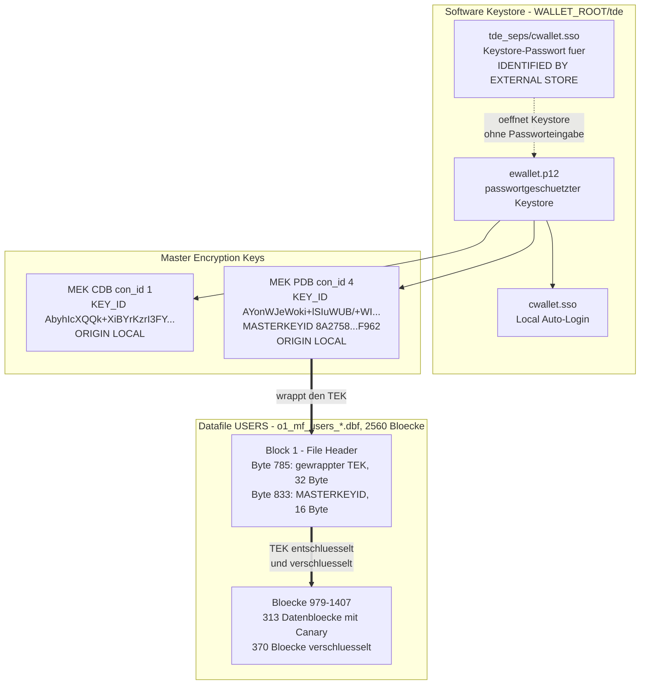
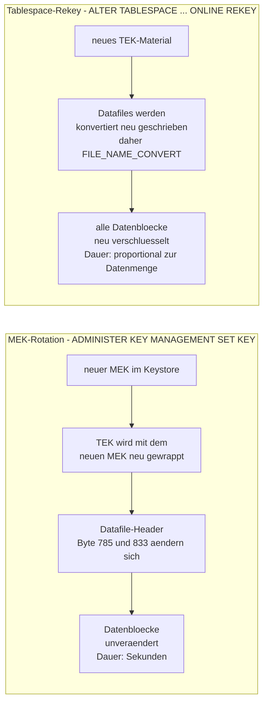
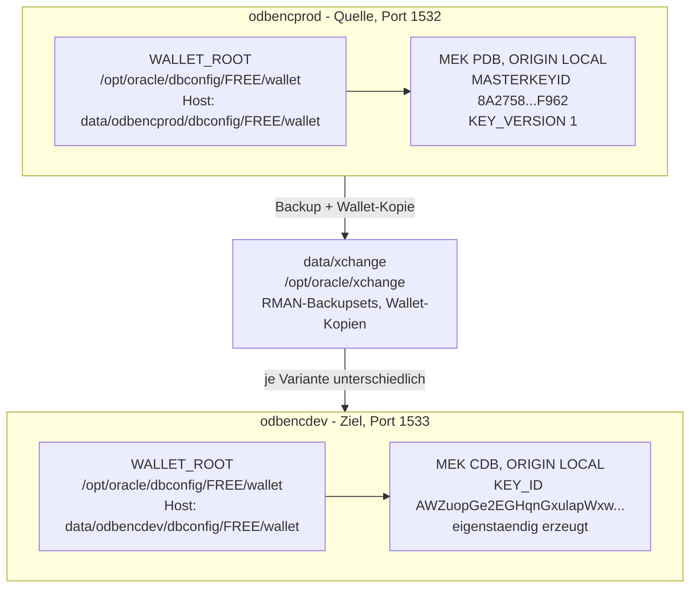
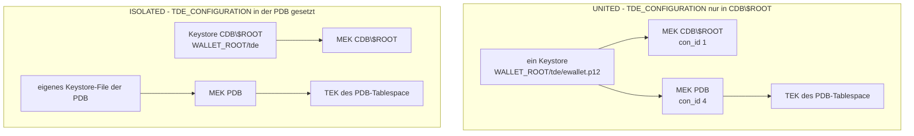
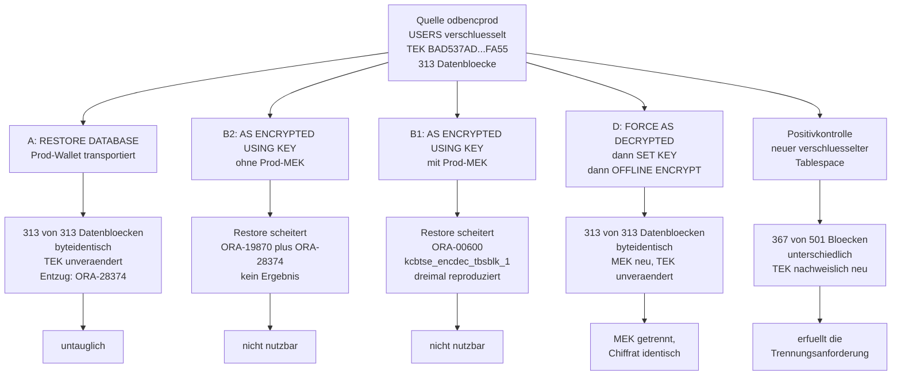
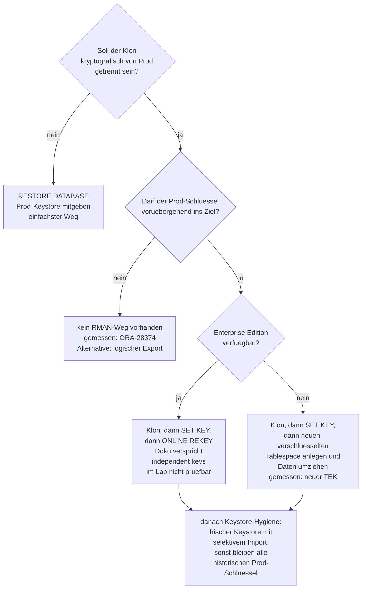

# TDE Schluesselarchitektur - Diagramme

Begleitdokument zu [tde-restore-as-encrypted.md](tde-restore-as-encrypted.md). Alle
Zahlenwerte in den Diagrammen sind am Lab gemessen, nicht illustrativ gewaehlt.
Messsatz: `data/xchange/evidence/baseline/`, Service `odbencprod`, PDB `ODBENCPROD`,
Tablespace `USERS`, Oracle AI Database Free 26ai.

## 1 Zwei-Ebenen-Schluesselhierarchie

Der Master Encryption Key liegt im Keystore, der Tablespace Encryption Key liegt im
Datafile-Header - dort mit dem MEK eingewickelt. Nur der TEK verschluesselt Datenbloecke.

Belegt durch die Suche nach den View-Werten in der Rohdatei: der gewrappte TEK
`BAD537AD...FA55` aus `V$ENCRYPTED_TABLESPACES.ENCRYPTEDKEY` wurde genau einmal im
Datafile gefunden, bei Offset 8977 gleich Block 1 Byte 785. Die `MASTERKEYID`
`8A27589796A248BE95222E59407FF962` liegt 48 Byte dahinter bei Offset 9025. In einem
unverschluesselten Kontroll-Datafile war keine der beiden Sequenzen vorhanden.

## 2 Die Terminologiefalle - beide Operationen heissen rekey

Der Unterschied entscheidet die Kundenfrage. Eine MEK-Rotation beruehrt keinen
einzigen Datenblock.

In Oracle Database Free ist die Online-Variante nicht unterstuetzt, siehe Licensing
Restrictions. Im Lab wird die Referenz daher ueber einen neuen verschluesselten
Tablespace mit Datenumzug gebildet.

## 3 Wo liegt welcher MEK und was aktualisiert ihn

Beide Container nutzen denselben containerinternen Pfad, der aber auf getrennte
Host-Verzeichnisse zeigt. Das ist genau die Kundenkonstellation: identische
Konfiguration, getrennte Schluesselbestaende.

Was den MEK aendert:

<!-- markdownlint-disable MD013 MD060 -->

| Ereignis | Wirkung auf den MEK | Wirkung auf den TEK | Wirkung auf Datenbloecke |
|---|---|---|---|
| `ADMINISTER KEY MANAGEMENT SET KEY` | neuer aktiver MEK, alter bleibt im Keystore | wird neu gewrappt | keine |
| Keystore-Kopie nach Dev | derselbe MEK, `ORIGIN` bleibt `LOCAL` in der Kopie | unveraendert | keine |
| `EXPORT`/`IMPORT KEYS` | MEK erscheint im Ziel mit `ORIGIN IMPORTED` | unveraendert | keine |
| `RESTORE ... AS ENCRYPTED USING KEY` | Ziel-MEK wird verwendet | offen - Messung | offen - Messung |
| Tablespace-Rekey | unveraendert | neues Material | alle neu verschluesselt |

<!-- markdownlint-restore -->

Die beiden mit "offen" markierten Zellen sind der Gegenstand des Tests. Sie sind in der
oeffentlichen Oracle-Dokumentation fuer den Fall verschluesselt nach verschluesselt
nicht belegt.

## 4 UNITED gegen ISOLATED Keystore-Modus

Im Lab laeuft alles im UNITED Mode. Gemessen an `odbencprod`: genau ein
Keystore-Verzeichnis `WALLET_ROOT/tde` plus `tde_seps` und `backups`, kein
PDB-eigenes Keystore-Verzeichnis, `KEYSTORE_MODE = UNITED` fuer die PDB, und
`TDE_CONFIGURATION = KEYSTORE_CONFIGURATION=FILE` ausschliesslich auf CDB-Ebene
gesetzt - die PDB hat keinen eigenen Wert und erbt.

Zum Moduswechsel gibt es zwei Aussagen, die sich nicht deckten und die hier
getrennt stehen bleiben, bis das Lab entscheidet:

- Oracle-Primaerdokumentation: der Wechsel laeuft ueber
  `ADMINISTER KEY MANAGEMENT ISOLATE KEYSTORE ... FROM ROOT KEYSTORE` in der PDB
  und zurueck ueber `UNITE KEYSTORE`. `TDE_CONFIGURATION` unterscheidet die Modi
  **nicht** ueber seinen Wert - beide nutzen `KEYSTORE_CONFIGURATION=FILE`. Eine
  isolierte PDB kann den Parameter danach separat setzen.
  Quelle: Administering United Mode und TDE_CONFIGURATION, Oracle 26ai.
- Praxisbeobachtung: wird `TDE_CONFIGURATION` in der PDB gesetzt, entsteht dort
  ein eigenes Keystore-File.

Beides kann zusammenpassen, wenn das Setzen des Parameters in der PDB die
Isolierung in der Praxis nach sich zieht. Belegt ist das nicht - der Punkt ist
im Lab zu pruefen und steht als offener Pruefpunkt in `tasks/todo.md`.

Beide Modi halten containerspezifische MEKs. Der Unterschied liegt darin, ob
diese Schluessel in einem gemeinsamen Keystore-File liegen oder in getrennten.
Fuer einen Klon von Prod nach Non-Prod heisst das: in UNITED wandert eine
Keystore-Datei mit allen MEKs, in ISOLATED wandern mehrere und die Zuordnung
muss stimmen.

Ein eigener PDB-MEK ist in UNITED nicht optional. Die Oracle-Dokumentation zu
United Mode sagt dazu, der Keystore werde vom CDB-Root verwaltet, muesse aber
einen fuer die PDB spezifischen TDE-Master-Key enthalten, damit die PDB TDE
nutzen kann. Ein dokumentierter Weg, PDB-Tablespace-Keys direkt mit dem
MEK von CDB\$ROOT zu wrappen und so mit einem einzigen MEK fuer die ganze
Datenbank zu arbeiten, ist nicht belegt. Nur eine Non-CDB haette naturgemaess
einen einzigen MEK.

Bei einer Single-Tenant-Umgebung mit genau einer PDB ist UNITED damit der
einfachere Weg, aber auch dort existieren zwei MEKs. Am Prinzip der Messung
aendert der Modus nichts - der TEK liegt in beiden Faellen im Datafile-Header
und wird von einem MEK gewrappt. ISOLATED erhoeht nur den Verwaltungsaufwand
beim Transport, und laut einer Sekundaerquelle ist ISOLATED von AutoUpgrade und
OCI-Tooling noch nicht vollstaendig unterstuetzt.

> Quellenstand: die Aussage, dass `TDE_CONFIGURATION` auf PDB-Ebene ein eigenes
> Keystore-File erzeugt, ist Praxiswissen und deckt sich nicht mit der
> Oracle-Primaerdokumentation, die den Moduswechsel ueber `ISOLATE KEYSTORE`
> beschreibt. Der Punkt wird im Lab gemessen.

## 5 Die Varianten im Vergleich

Alle Varianten starten bei derselben Quelle: PDB `ODBENCPROD`, Tablespace `USERS`
verschluesselt mit AES256, gewrappter TEK `BAD537AD...FA55` unter MASTERKEYID
`8A2758...F962`, 313 Canary-Datenbloecke.

Die Positivkontrolle ist der Beweis, dass die Messung ueberhaupt greift: zwei
Tablespaces mit identischem Inhalt, identischen Blockadressen und verschiedenen
TEKs liefern unterschiedliches Chiffrat. Wo Quelle und Klon byteidentisch sind,
ist der TEK also wirklich derselbe und nicht nur die Messung blind.

## 6 Entscheidungsbaum fuer den Kunden

Der Kasten zur Keystore-Hygiene ist kein Nebenschauplatz. Ein kopierter Keystore
enthaelt die vollstaendige Schluesselhistorie der Quelle, und `ORIGIN` zeigt fuer
diese Schluessel im Ziel `LOCAL` - die Herkunft ist an den Views nicht erkennbar.
