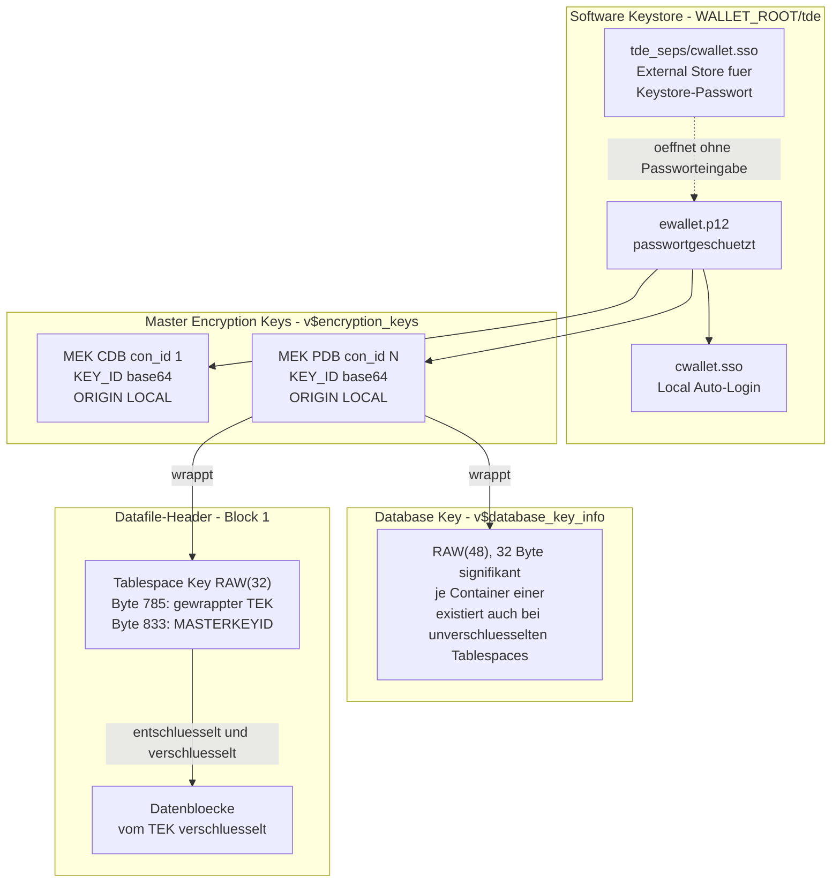
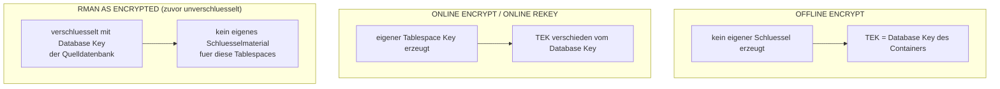
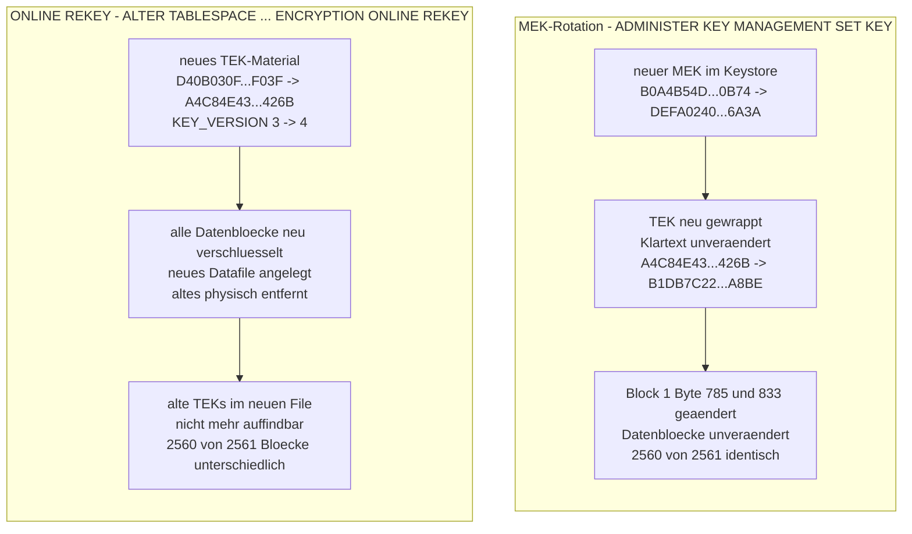
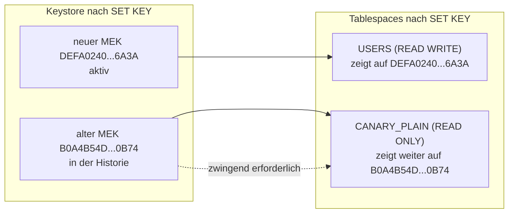
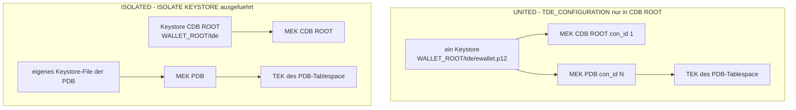
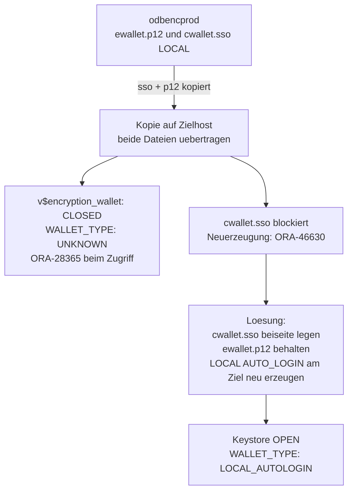
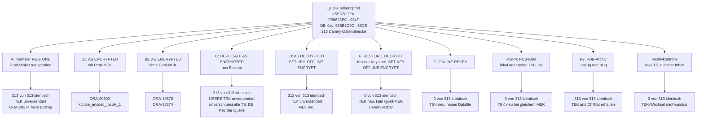
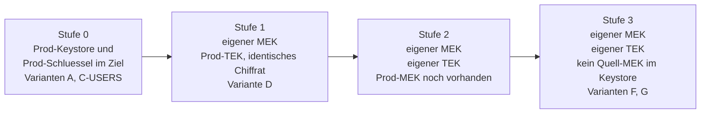

# TDE Schluesselarchitektur

Diagramm- und Erklaerdokument zur TDE-Schluesselarchitektur in Oracle AI Database
Free 26ai. Begleitdokument zu [tde-restore-as-encrypted.md](tde-restore-as-encrypted.md).
Alle Zahlenwerte sind am Lab gemessen, Messsatz `data/xchange/evidence/`,
Services `odbencprod` und `odbencdev`, PDB `ODBENCPROD`, Tablespace `USERS`.

## Lesehinweis

Das Dokument folgt der Reihenfolge: Schluesselstruktur (Kapitel 2), eine haeufig
uebersehene Ausnahme (Kapitel 3), gemessene Wirkung je Operation (Kapitel 4),
Sonderfaelle (Kapitel 5-7), Variantenvergleich (Kapitel 8) und Stufenmodell (Kapitel 9).
Kapitel 4 enthaelt die Terminologiefalle, die den Kernbefund des Tests erklaert.

## Die drei Schluesselebenen

Drei Ebenen sind aktiv, wenn ein Tablespace mit TDE geschuetzt wird. Sie liegen an
unterschiedlichen Orten und haben unterschiedliche Rollen.

<!-- markdownlint-disable MD013 MD060 -->

| Ebene | View | Format | Speicherort | Anzahl |
|---|---|---|---|---|
| MEK | `v$encryption_keys` | KEY_ID base64 | Keystore `ewallet.p12` | je Container ein aktiver, dazu die Historie |
| Database Key | `v$database_key_info` | RAW(48), 32 Byte signifikant | von Oracle verwaltet, vom MEK gewrappt | je Container einer |
| Tablespace Key | `v$encrypted_tablespaces` | RAW(32) | gewrappt im Datafile-Header, bei 8K in Block 1 Byte 785 | je verschluesseltem Tablespace einer |

<!-- markdownlint-restore -->



Physisch nachgewiesen: der gewrappte TEK aus `v$encrypted_tablespaces.ENCRYPTEDKEY`
wurde genau einmal im Rohdatafile gefunden, bei Offset 8977 gleich Block 1 Byte 785.
Die `MASTERKEYID` liegt bei Offset 9025, 48 Byte dahinter. In einem unverschluesselten
Kontroll-Datafile kein Treffer. Gemessen in zwei unabhaengigen Aufbauten, die Offsets
waren in beiden identisch.

## Nicht jeder Tablespace hat einen eigenen Schluessel

Das ist der Punkt, an dem Erwartung und Messung auseinandergehen. Die verwendete
Verschluesselungsoperation entscheidet, ob ein Tablespace einen eigenen Schluessel
erhaelt oder den Database Key des Containers uebernimmt.



Gemessene Belege:

- Nach Variante F trug `USERS` (per `OFFLINE ENCRYPT` verschluesselt) exakt den
  DB-Key-Wert `D40B030F...F03F` als TEK.
- `CANARY_PLAIN` erhielt per `ONLINE ENCRYPT` einen eigenen TEK `A1EBE741...`,
  `USERS` nach `ONLINE REKEY` den TEK `A4C84E43...426B` - beide verschieden vom DB Key.
- In Variante C (DUPLICATE AS ENCRYPTED) erhielten `SYSTEM`, `SYSAUX`, `UNDOTBS1`,
  `AUDIT_DATA` und `CANARY_PLAIN` alle den Wert `566B2C9C...69CE`, den Database Key
  der Quell-PDB.

Der Doku-Wortlaut "the tablespace will have its own independent encryption keys and
algorithms" bezieht sich ausschliesslich auf Online-Operationen. Das ist hier am
Verhalten belegt.

## Wirkung je Operation

<!-- markdownlint-disable MD013 MD060 -->

| Operation | MEK | Database Key | Tablespace Key | Datenbloecke |
|---|---|---|---|---|
| `SET KEY` MEK-Rotation | neu | neu gewrappt, Klartext gleich | neu gewrappt, KEY_VERSION unveraendert | unveraendert, 2560 von 2561 identisch |
| `ONLINE REKEY` | unveraendert | unveraendert | **neuer Schluessel**, KV plus 1 | **alle neu verschluesselt**, neues Datafile, altes entfernt |
| `ONLINE ENCRYPT` | unveraendert | unveraendert | **neuer eigener Schluessel** | verschluesselt |
| `OFFLINE ENCRYPT` | unveraendert | unveraendert | **uebernimmt den Database Key** | verschluesselt |
| `OFFLINE DECRYPT` | unveraendert | unveraendert | Handle bleibt im Header stehen | entschluesselt |
| RMAN `AS ENCRYPTED` | Quelle | Quelle | unverschluesselte TS erhalten DB Key, verschluesselte behalten ihren | bei verschluesselten unveraendert |

<!-- markdownlint-restore -->

### Die Terminologiefalle

Beide Operationen heissen umgangssprachlich "rekey". Der Unterschied ist
kryptografisch entscheidend.



Belege fuer die MEK-Rotation:

- Alert Log woertlich: `KZTDE: Set Master Key: Tablespace key rewrap done`
- Blockvergleich: 2560 von 2561 Bloecken identisch, Verdict "RE-WRAP INDICATED"
- KEY_VERSION des TEK unveraendert bei 4

Belege fuer `ONLINE REKEY`:

- KEY_VERSION 3 auf 4, TEK `D40B030F...F03F` auf `A4C84E43...426B`
- Neues Datafile angelegt, altes physisch entfernt
- Alte TEKs im neuen File nicht mehr auffindbar
- `ONLINE REKEY` ist in Oracle Database Free 26ai technisch ausfuehrbar. Die
  Licensing Restriction ist eine Lizenz- und Supportaussage, kein technischer Riegel.

## Read-only-Tablespaces

Bei der MEK-Rotation werden Read-only-Tablespaces nicht umgewickelt. Oracle kann
den Datafile-Header eines Read-only-Tablespace nicht schreiben.



Gemessen: `CANARY_PLAIN` stand auf `READ ONLY` und verwies nach der MEK-Rotation
weiter auf den alten MEK `B0A4B54D...0B74`, waehrend `USERS` und der Database Key
auf `DEFA0240...6A3A` zeigten.

Folge: der alte MEK bleibt zwingend erforderlich. Die vollstaendige Schluesselhistorie
muss im Keystore bleiben. Operativ relevant, weil Archiv-Tablespaces haeufig read-only
sind. Wer den alten MEK entfernt, verliert den Zugriff auf jeden read-only Tablespace,
der ihn referenziert.

## UNITED gegen ISOLATED

Im Lab laeuft alles im UNITED Mode. Gemessen an `odbencprod`:

- ein Keystore-Verzeichnis `WALLET_ROOT/tde` plus `tde_seps` und `backups`
- kein PDB-eigenes Keystore-Verzeichnis
- `KEYSTORE_MODE = UNITED` fuer die PDB
- `TDE_CONFIGURATION = KEYSTORE_CONFIGURATION=FILE` ausschliesslich auf CDB-Ebene
- Alert Log: `KZTDE:kztsmptc: keystore mode: United`

Korrektur zu einer frueheren Annahme: `TDE_CONFIGURATION` unterscheidet die Modi
**nicht** ueber seinen Wert. Beide nutzen `KEYSTORE_CONFIGURATION=FILE`. Der Wechsel
laeuft ueber `ADMINISTER KEY MANAGEMENT ISOLATE KEYSTORE ... FROM ROOT KEYSTORE`
in der PDB und zurueck ueber `UNITE KEYSTORE`.



Die Praxisbeobachtung, dass ein in der PDB gesetztes `TDE_CONFIGURATION` ein eigenes
Keystore-File erzeugt, ist nicht durch die Oracle-Primaerdokumentation belegt und
bleibt ein offener Pruefpunkt. Beides kann zusammenpassen, wenn das Setzen des
Parameters in der PDB die Isolierung nach sich zieht - gemessen ist das nicht.

Ein eigener PDB-MEK ist in UNITED nicht optional. Ein dokumentierter Weg, PDB-Tablespace-
Keys direkt mit dem MEK von `CDB$ROOT` zu wrappen, ist nicht belegt. Nur eine Non-CDB
haette naturgemaess einen einzigen MEK.

## Keystore-Portabilitaet

Ein `LOCAL` Auto-Login-Keystore ist an den erzeugenden Host gebunden. Das hat
Konsequenzen beim Transport.



Gemessen in drei Varianten unabhaengig aufgetreten. Das funktionierende Vorgehen:

```sql
ADMINISTER KEY MANAGEMENT CREATE LOCAL AUTO_LOGIN KEYSTORE
  FROM KEYSTORE '/opt/oracle/dbconfig/FREE/wallet/tde' IDENTIFIED BY <pwd>;
```

Wichtiger Nebenbefund: `ORIGIN` zeigt fuer transportierte Schluessel im Ziel `LOCAL`,
nicht `IMPORTED`. Wer die Keystore-Datei kopiert, hinterlaesst keine Spur der Herkunft.
`ORIGIN` taugt nicht als Nachweis lokaler Schluesselerzeugung. Betrifft auch den
SEPS-Store `tde_seps`, der ebenfalls als `LOCAL AUTO_LOGIN` angelegt wird.

## Die Varianten im Vergleich

<!-- markdownlint-disable MD013 MD060 -->

| Variante | Vorgehen | Canary-Bloecke identisch | TEK USERS | Ergebnis |
|---|---|---|---|---|
| A | normaler RESTORE, Prod-Wallet transportiert | 313 von 313 | unveraendert | laeuft; Entzugstest: ORA-28374 |
| B1 | AS ENCRYPTED USING KEY mit Prod-MEK | - | - | ORA-00600 [kcbtse\_encdec\_tbsblk\_1], dreimal reproduziert |
| B2 | AS ENCRYPTED USING KEY ohne Prod-MEK | - | - | ORA-19870 plus ORA-28374 |
| C | DUPLICATE BACKUP LOCATION AS ENCRYPTED | 313 von 313 | unveraendert | laeuft, neue DBID; unverschluesselte TS erhalten DB Key der Quelle |
| D | FORCE AS DECRYPTED, SET KEY, OFFLINE ENCRYPT | 313 von 313 | unveraendert | MEK neu, Chiffrat identisch; kein kryptografischer Neuanfang |
| F | RESTORE, OFFLINE DECRYPT, Undo-Tausch, frischer Keystore, \_db\_discard\_lost\_masterkey, SET KEY, OFFLINE ENCRYPT | 0 von 313 | **neu** | Quell-TEK und Quell-MASTERKEYID physisch verschwunden, kein Quell-MEK, Canary lesbar |
| G | ONLINE REKEY | 0 von 313 | **neu** | neues Datafile, altes entfernt, alte TEKs nicht mehr auffindbar |
| P1 | PDB-Klon in derselben CDB | 0 von 313 | **neu** | MASTERKEYID identisch zur Quelle, gewrappter Schluessel verschieden - unter unveraendertem MEK kein Re-wrap moeglich |
| P2 | PDB-Archiv in eine fremde CDB | 313 von 313 | unveraendert | gewrappter Schluessel identisch; Transport erhaelt Schluessel und Chiffrat |
| P4 | PDB-Remote-Klon ueber DB-Link | 0 von 313 | **neu** | wie P1, ueber CDB-Grenze hinweg |
| Positivkontrolle | zwei frische verschluesselte TS mit identischem Inhalt und verschiedenen TEKs | 0 von 313 | verschieden | die Methode erkennt einen Schluesselwechsel in jedem Canary-Block |

<!-- markdownlint-restore -->

Anmerkung zu Variante B1: das erste Backup-Set mit unverschluesselten CDB-Datafiles
wurde in 5:45 erfolgreich konvertiert, gegenueber 3 Sekunden bei normalem Restore.
Beide Zeiten sind Einzelbeobachtungen und wurden nicht wiederholt gemessen; sie belegen
die Richtung, nicht einen Kennwert.
`AS ENCRYPTED` leistet bei unverschluesselter Quelle echte Blockarbeit - das Abbrechen
tritt erst beim bereits verschluesselten Datafile auf.

### Der Kontrast D gegen F belegt die dritte Ebene

Beide Varianten fuehren dieselbe Anweisung aus:
`ALTER TABLESPACE USERS ENCRYPTION OFFLINE ENCRYPT`. Sie unterscheiden sich in genau einer
Variablen - ob der Database Key des Containers erneuert wurde.

<!-- markdownlint-disable MD013 MD060 -->
| | Variante D | Variante F |
|---|---|---|
| MEK | neu gesetzt | neu, frischer Keystore |
| Database Key | unveraendert | erneuert ueber den Discard-Pfad |
| Operation | `OFFLINE ENCRYPT` | `OFFLINE ENCRYPT` |
| Canary-Chiffrat | 313 von 313 identisch | 0 von 313 identisch |
<!-- markdownlint-restore -->

Dieselbe Anweisung, entgegengesetztes Ergebnis. Damit ist gemessen, dass `OFFLINE ENCRYPT`
sein Tablespace-Schluesselmaterial aus dem **Database Key des Containers** ableitet und nicht
aus dem MEK: eine MEK-Rotation allein aendert das Chiffrat nachweislich nicht. Oracle
dokumentiert nur zwei Ebenen; diese Messung ist die Grundlage fuer die dritte in diesem
Dokument.

Anmerkung zu Variante C: der als "neuer gemeinsamer TEK" gemessene Wert
`566B2C9C...69CE` ist der Database Key der PDB in der Quelle. AS ENCRYPTED hat die
fuenf unverschluesselten Tablespaces unter dem vorhandenen Database Key der Quelle
verschluesselt.



## Stufenmodell der kryptografischen Unabhaengigkeit

Die Stufen leiten sich ausschliesslich aus den Messergebnissen ab.



<!-- markdownlint-disable MD013 MD060 -->

| Stufe | Merkmal | Varianten | Was gemeinsam bleibt | Kryptografische Trennung |
|---|---|---|---|---|
| 0 | Prod-Keystore und Prod-TEK im Ziel | A, C (USERS-Teil) | MEK, TEK, Chiffrat | keine |
| 1 | Eigener MEK, Prod-TEK | D | TEK-Klartext, Chiffrat identisch | MEK-Trennung, kein Schutz des Chiffrats |
| 2 | Eigener MEK, eigener TEK, Prod-MEK noch im Keystore | Zwischenzustand nach F vor Keystore-Bereinigung | Prod-MEK vorhanden | TEK getrennt, Keystore-Kontrolle noch nicht vollstaendig |
| 3 | Eigener MEK, eigener TEK, kein Quell-MEK | F, G | nichts Schluesselrelevantes | vollstaendig |

<!-- markdownlint-restore -->

Hinweis zu Variante F: `_db_discard_lost_masterkey` ist ein Hidden Parameter,
dokumentiert in einer MOS Note. Einsatz nur nach Abklaerun mit Oracle Support.
Fachlich zulaessig ausschliesslich nach vollstaendigem `AS DECRYPTED`, wenn
nachweislich kein verschluesseltes Objekt mehr existiert. Eine Sekundaerquelle
warnt bei wiederholtem Einsatz vor echten Korruptionen (ORA-01595, ORA-28304).
Gemessen in Oracle AI Database Free 26ai, nicht in Enterprise Edition.

Im Fenster zwischen `OFFLINE DECRYPT` und `OFFLINE ENCRYPT` in Variante F liegen
die Daten unverschluesselt. Das ist ein bewusster Sicherheitskompromiss.

## Quellen

- Oracle Backup and Recovery Reference 19c, RESTORE:
  <https://docs.oracle.com/en/database/oracle/oracle-database/19/rcmrf/RESTORE.html>
- Oracle Backup and Recovery Reference 26ai, RESTORE:
  <https://docs.oracle.com/en/database/oracle/oracle-database/26/rcmrf/RESTORE.html>
- Oracle Backup and Recovery Reference 19c, DUPLICATE:
  <https://docs.oracle.com/en/database/oracle/oracle-database/19/rcmrf/DUPLICATE.html>
- Oracle Database Free 26ai, Licensing Restrictions:
  <https://docs.oracle.com/en/database/oracle/oracle-database/26/xeinl/licensing-restrictions.html>
- Oracle TDE 26ai, Encryption Conversions for Tablespaces:
  <https://docs.oracle.com/en/database/oracle/oracle-database/26/dbtde/encryption-conversions-tablespaces-and-databases1.html>
- Oracle Reference 19c, V$ENCRYPTED\_TABLESPACES:
  <https://docs.oracle.com/en/database/oracle/oracle-database/19/refrn/V-ENCRYPTED_TABLESPACES.html>
- Oracle TDE 26ai, Administering United Mode:
  <https://docs.oracle.com/en/database/oracle/oracle-database/26/dbtde/administering-united-mode1.html>
- Oracle Reference 26ai, TDE\_CONFIGURATION:
  <https://docs.oracle.com/en/database/oracle/oracle-database/26/refrn/TDE_CONFIGURATION.html>
- Oracle Advanced Security 19c, Managing Keystores in United Mode:
  <https://docs.oracle.com/en/database/oracle/oracle-database/19/asoag/managing-keystores-encryption-keys-in-united-mode.html>
- Oracle TDE 26ai, ORA-28374:
  <https://docs.oracle.com/en/database/oracle/oracle-database/26/dbtde/error-ora-28374-typed-master-key-not-found.html>
- Oracle Advanced Security 19c, Configuring TDE:
  <https://docs.oracle.com/en/database/oracle/oracle-database/19/asoag/configuring-transparent-data-encryption.html>
- Asanga Pradeep Blog, 19c Encryption (Sekundaerquelle):
  <https://asanga-pradeep.blogspot.com/2019/10/19c-encryption.html>
