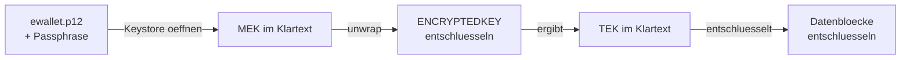

# TDE und Oracle Key Vault: Angriffsflaechen und Argumentation

Adressiert an DBAs und Security-Architekten, die zwei spezifische Kundeneinwaende
klaeren wollen. Faktengrundlage: Labmessungen 2026-09-03 und 2026-09-04 sowie der
durchgehende E2E-Lauf vom 2026-09-06 an Oracle AI Database Free 26ai, dazu
Oracle-Primaerdokumentation, Standards und Sekundaerquellen. Quellen am Ende des Dokuments.

Das Dokument trennt zwei Arten von Aussagen und benennt sie jeweils:

- **Gemessen** - im Lab beobachtet, mit Fehlercode, Schluessel-ID oder Blockzahl belegt.
- **Argumentativ** - aus Architektur, Kryptografie oder Dokumentation abgeleitet, nicht
  im Lab nachgestellt.

## Die beiden Kundeneinwaende

**Einwand 1:** "Wir aendern doch ohnehin nur den MEK nach dem Klon. Dann ist Test gleich Prod
und der Unterschied nur ein anderer Schluessel."

**Einwand 2:** "Mit den Tablespace-Key-Infos aus der Test-Datenbank kann man die Prod
entschluesseln. Was bringt da OKV?"

### Ehrliche Einordnung

Beide Einwaende haben einen realen Kern, ziehen aber die falschen Schluesse.

Einwand 1 beschreibt das Verhalten korrekt: eine MEK-Rotation aendert nur den Wrapper,
nicht das Chiffrat. Gemessen: 313 von 313 Canary-Bloecken sind vor wie nach der Rotation
byteidentisch, und zwar in beiden Tablespace-Zustaenden. Die Frage ist also nicht, ob die
Bloecke gleich bleiben - sie bleiben es. Die Frage ist, wo der Prod-Schluessel liegt. Beim
file-basierten Modell wandert der Keystore mit dem Klon, und damit die vollstaendige
Schluesselhistorie.

Einen technisch sauberen Ausweg gibt es allerdings, und er gehoert fair benannt: der
**PDB-Klon** erzeugt neues Schluesselmaterial (siehe Abschnitt "Der PDB-Klon"). Er
entschaerft Einwand 1 auf der technischen Seite, loest das Herkunftsproblem aber nicht.

Einwand 2 beschreibt in seiner strikten Lesart ein Szenario, das nicht zutrifft: ein
Tablespace-Key aus einer Test-Datenbank erlaubt keinen Zugriff auf Prod. Das wurde gemessen.
Der reale Kern liegt aber woanders: ist der Non-Prod-Keystore eine Kopie des Prod-Keystores,
enthaelt er die Prod-MEKs - und die ermoeglichen den Zugriff auf Prod-Backups.

## Die Angriffskette

Vollstaendige Kette. Alle Glieder sind notwendig:



Der gewrappte TEK allein ist ohne den passenden MEK kryptografisch wertlos.
`V$ENCRYPTED_TABLESPACES.ENCRYPTEDKEY` und `MASTERKEYID` sind lesbar fuer jeden mit
Datenbankzugriff - ohne den MEK nuetzen sie nichts.

## Angriffsflaechen

### Tabelle

<!-- markdownlint-disable MD013 MD060 -->

| Angriff | Bewertung | Voraussetzungen | Im Lab gemessen |
|---|---|---|---|
| Non-Prod-Keystore plus Prod-Backup | real und gravierend, wenn Keystore kopiert wurde | Keystore-Datei und Passphrase der Non-Prod | ja (Variante A: vollstaendiger Zugriff auf Prod-Daten) |
| Ciphertext-Existenzvergleich Prod gegen Non-Prod | real, geringer Aufwand | Lesezugriff auf Non-Prod-Datafiles und Prod-Backups, kein Keystore noetig | ja (byteidentische Bloecke in Variante A, D) |
| Rueckschluss auf Datenaenderungen ueber Backup-Generationen | real, geringer Aufwand | mehrere Prod-Backups, kein Keystore noetig | ja, aus Variante A ableitbar |
| Test-DB ohne Prod-MEK restauriert Prod-Daten | nicht moeglich | - | ja, Gegenbeweis gemessen: ORA-19870 plus ORA-28374 |
| Test-DB liest Prod-Daten ueber TS-Key-Info | nicht moeglich | - | ja, Gegenbeweis: Entzugstest, Datenbank bleibt MOUNTED mit ORA-28374 |
| Transportierter Prod-Schluessel im Ziel als lokal erzeugt getarnt | real, kein Angriff im engeren Sinn, sondern fehlende Nachweisbarkeit | EXPORT/IMPORT KEYS oder Keystore-Kopie | ja (P7: ORIGIN = LOCAL in fremder CDB, gleiche Erzeugungszeit wie in der Quelle) |
| Verschluesselte PDB ohne Schluessel wegtragen | nicht moeglich | - | ja, Gegenbeweis: Unplug ohne Key-Export scheitert mit ORA-46680, es entsteht kein Archiv |
| Known-Plaintext gegen AES-256-XTS | theoretisch, praktisch nicht ausnutzbar | 2^32 Klartextbloecke und 2^96 Operationen; fuer 128-Bit-Blockchiffren nicht praktikabel | nein |
| Brute Force gegen AES-256 | hypothetisch | 2^256 Schluesselraum; NIST empfiehlt AES-256 bis mindestens 2031 | nein |

<!-- markdownlint-restore -->

**Nicht belegt:** Ciphertext-Existenzvergleich und Aenderungsrueckschluss sind in der
Oracle-Dokumentation nicht als benannte Angriffsklasse beschrieben. Sie sind kryptografisch
ableitbar und im Lab an byteidentischen Bloecken beobachtet.

### Gemessener Kernbefund: Restore scheitert ohne Prod-MEK

Testreihe 2026-09-04. Ausgangslage: Test-Datenbank mit eigenem Keystore, Prod-MEKs nicht
vorhanden (0 von 6 Quell-Schluesseln im Ziel-Keystore). Versuch, einen Prod-Backup-Satz
zu restaurieren:

```text
ORA-19870: error while restoring backup piece .../0506atr0_5_1_1
ORA-28374: typed master key not found in wallet
```

Der Restore bricht ab, bevor ueberhaupt gelesen wird. Die Test-Datenbank kennt alle
eigenen TS-Key-Werte aus ihren V$-Views - das ist ohne Belang.

Der Entzugstest des E2E-Laufs vom 2026-09-06 faellt noch schaerfer aus als bisher
dokumentiert: wird der Quell-MEK nachtraeglich entzogen, **oeffnet die Zieldatenbank nicht
mehr**. Sie bleibt mit `ORA-28374` auf `MOUNTED` stehen. Es ist also nicht ein einzelner
Tablespace unlesbar, sondern die Datenbank unbrauchbar. Fuer die Argumentation heisst das:
der Prod-Schluessel ist im Ziel nicht optional, und er laesst sich nach dem Klon nicht
einfach wieder herausnehmen.

### Gemessener Kernbefund: die Herkunft eines Schluessels ist nicht feststellbar

Ein per `EXPORT KEYS` / `IMPORT KEYS` aus der Produktion in eine **fremde** CDB
transportierter Schluessel meldet dort `ORIGIN = LOCAL`, mit derselben Erzeugungszeit wie
in der Quelle. Die Ziel-CDB hat eine eigene DBID und einen eigenen Keystore aus ihrem
eigenen Setup - und trotzdem unterscheidet nichts in `V$ENCRYPTION_KEYS` den transportierten
Produktionsschluessel von einem vor Ort erzeugten.

Damit ist die Frage "woher stammt dieser Schluessel" mit einem Software-Keystore aus der
Datenbank heraus nicht beantwortbar. Das ist der Kern des OKV-Arguments, und es steht jetzt
auf einer Messung statt auf einer Ableitung. Wer Herkunft nachweisen muss - fuer ein Audit,
eine Zonentrennung oder eine Compliance-Aussage - braucht dafuer eine Instanz ausserhalb der
Datenbank.

## Der reale Befund: der Keystore wandert mit

Die gaengige Klon-Praxis (Variante A) kopiert den Prod-Keystore in die Non-Prod, inklusive
der vollstaendigen Schluesselhistorie. Wer in der Non-Prod `V$ENCRYPTION_KEYS` abfragt,
sieht alle Prod-MEKs - aber mit `ORIGIN = LOCAL`, nicht `ORIGIN = IMPORTED`.

Gemessener Befund:

- Transportierte Prod-Schluessel zeigen in `V$ENCRYPTION_KEYS` den Wert `LOCAL`, nicht
  `IMPORTED` - und dieselbe Erzeugungszeit wie in der Quelle. Die Herkunft des Schluessels
  ist an den Views nicht erkennbar, auch nicht in einer CDB mit eigener DBID und eigenem
  Keystore.
- `ORIGIN` taugt deshalb nicht als Nachweis lokaler Schluesselerzeugung.
- Eine MEK-Rotation raeumt die Schluesselhistorie nicht ab. Alle alten MEKs bleiben im
  Keystore, damit aeltere Backups weiterhin entschluesselbar bleiben.
  Quelle: Oracle Advanced Security 19c, Introduction to TDE.
- Read-only-Tablespaces koennen bei einer MEK-Rotation gar nicht neu eingewickelt werden.
  Oracle kann den Datafile-Header eines Read-only-Tablespace nicht schreiben.
  Gemessener Befund (P5): nach der Rotation zeigte der READ-ONLY-Tablespace weiter auf den
  Quellschluessel `A7D954A5...347D`, waehrend der READ-WRITE-Tablespace bereits auf
  `EFDFB56C...DC5F` verwies. Der alte MEK bleibt zwingend erforderlich, sonst sind die Daten
  unlesbar.
- Kein RMAN-Weg erneuert das Schluesselmaterial. Weder `RESTORE`, noch
  `DUPLICATE ... AS ENCRYPTED`, noch der Umweg ueber `AS DECRYPTED` mit anschliessendem
  Neuverschluesseln. Neues Material entsteht nur ueber PDB-Klon, `ONLINE REKEY` oder den
  Discard-Pfad.

Konsequenz: wer nach einem Klon nur den aktiven MEK rotiert, entfernt keinen einzigen
Prod-Schluessel aus dem Non-Prod-Keystore. Wer den Prod-Keystore kopiert hat und dann
in Non-Prod eine MEK-Rotation durchfuehrt, hat danach mehr Schluessel im Keystore als
vorher - alle Prod-MEKs aus der Historie plus den neuen Non-Prod-MEK.

## Der PDB-Klon - was er loest und was nicht

Der PDB-Klon ist der einzige gemessene Weg, der mit einem einzigen regulaer unterstuetzten
Kommando zugleich kopiert und das Schluesselmaterial erneuert - lokal (P1) wie remote ueber
DB-Link (P4), in beiden Faellen 0 von 313 Canary-Bloecken identisch zur Quelle. Die
Beweisfuehrung kommt ohne Annahmen aus: die `MASTERKEYID` bleibt unveraendert
(`A7D954A5...347D`), der gewrappte Schluessel unterscheidet sich - unter unveraendertem MEK
kann das kein Re-wrap sein.

**Was der Klon loest:** Einwand 1 auf der technischen Seite. Es gibt einen praktikablen Weg
zu einer Kopie mit eigener Schluesselbasis. Wer argumentiert, eine Trennung sei ohne OKV
technisch unmoeglich, argumentiert falsch.

**Was der Klon nicht loest:** das Herkunftsproblem. Auch nach einem Klon bleibt unsichtbar,
welche Schluessel im Keystore woher stammen - der Klon aendert nichts daran, dass `ORIGIN`
fuer jeden Schluessel `LOCAL` meldet. Und der Klon setzt weiterhin voraus, dass der
Quell-MEK im Ziel-Keystore verfuegbar ist: jede PDB-Operation ueber verschluesselte
Tablespaces verlangt das Keystore-Passwort (`ORA-46697`), ein Auto-Login-Keystore genuegt
fuer keine davon.

Der Gegenpol dazu ist der Archiv-Transport (P2): Unplug und Plug-in verschieben die Dateien
unveraendert und transportieren die Schluessel mit - gewrappter Schluessel identisch,
313 von 313 Bloecken identisch, und das in eine CDB mit eigener DBID und eigenem Keystore.

## Was OKV daran aendert

**Belegte Mechanismen:**

<!-- markdownlint-disable MD013 MD060 -->

| Merkmal | Software-Keystore | OKV |
|---|---|---|
| Schluessel-Extraktion | Datei plus Passphrase genuegt fuer alle Schluessel | Non-Extractable Keys konfigurierbar |
| Kopierbarkeit | Datei beliebig kopierbar; kein Herkunftsnachweis in ORIGIN | kein lokales File, Zugang nur ueber KMIP/TLS |
| Audit je Schluesselzugriff | nicht vorhanden | vollstaendiger Audit-Trail |
| Separation of Duties | DBA haelt Keystore und Datenbank | drei Rollen: Key Administrator, System Administrator, Audit Manager |
| RAC und Data Guard | Wallet manuell auf alle Knoten kopieren | Propagation ueber Endpoints |
| Zugriff je Umgebung | keine technische Trennung | getrennte Virtual Wallets und Endpoint Groups |
| Schluesselverlust | Passwortverlust bedeutet Datenverlust | zentrale Sicherung und Recovery |
| Compliance-Reporting | nicht vorhanden | Endpoint Activity, User Activity, TDE Key Metadata, Backup History |

<!-- markdownlint-restore -->

Zitat OKV: "Managing keys in Oracle Key Vault mitigates risks associated with disk-based
private keys, including key theft, unauthorized copying and sharing of keys, and key loss."
Quelle: OKV Administration Guide 21.11.

Zitat zur Rollentrennung: "In a strict separation of duties environment, different users are
responsible for different functions. For example, for endpoints, the operations to manage an
endpoint and grant permissions to the endpoint must be done by different users."
Quelle: OKV STIG Hardening Guide 21.8.

Zitat zum Lifecycle: "Failed access attempts, non-compliant keys, and keys that have not been
rotated for too long will no longer go undetected."
Quelle: OKV Administration Guide 21.11.

**Zur Klon-Trennung:** Virtual Wallets koennen je Benutzer, Gruppe, Endpoint oder
Endpoint Group mit den Rechten Read Only, Read and Modify oder Manage Wallet zugewiesen
werden. Entzug ist jederzeit moeglich. Das verhindert, dass ein Non-Prod-Endpoint auf
den Prod-Wallet zugreift, und umgekehrt.

**Nicht belegt:** ein von Oracle dediziert dokumentiertes Prod/Non-Prod-Klon-Muster.
Die Konstrukte (Virtual Wallets, Endpoint Groups, Rechtevergabe) sind belegt, das Muster
ist daraus ableitbar. Sekundaerquelle zum Klonen mit OKV:
<https://www.dbi-services.com/blog/clone-oracle-database-configured-with-oracle-key-vault-okv/>

## Argumente fuer OKV unabhaengig vom Klon-Thema

**Schluesselverlust:** Ein verlorenes oder vergessenes Wallet-Passwort bedeutet beim
Software-Keystore permanenten Datenverlust. OKV bietet zentrale Sicherung und Recovery.

**RAC und Data Guard:** Beim Software-Keystore muss die Wallet-Datei manuell auf alle
RAC-Knoten und Standby-Systeme kopiert und synchronisiert werden. OKV propagiert
Schluessel ueber Endpoints.

**Lifecycle und Rotation:** OKV erkennt abgelaufene oder nicht rotierte Schluessel und
nicht-konforme Konfigurationen. Beim Software-Keystore ist das nicht vorhanden - weder
eine automatisierte Erkennung noch ein zentrales Reporting.

**Compliance-Reporting:** OKV liefert Endpoint Activity, User Activity, TDE Key Metadata
und Backup History. Beim Software-Keystore gibt es keinen Audit-Trail fuer
Schluesselzugriffe ausserhalb des normalen DB-Audits.

**STIG-Haertungsmodus:** OKV bietet einen eigenen STIG-Haertungsmodus. Rollentrennung
ist ab Version 21.9 erzwingbar.
Quelle: OKV STIG Hardening Guide 21.8.

**FIPS-140:** Die Vorgabe V-270571 des DISA-STIG fordert FIPS-140-validierte
Kryptomodule. OKV kann in diesem Kontext eingesetzt werden.

## Gegenposition - fair

**Verfuegbarkeitsabhaengigkeit:** Die Datenbank braucht OKV beim Start und bei
Schluesselbedarf. Standalone-Betrieb ist laut Oracle nur fuer Test und Dev vorgesehen.
Ein OKV-Ausfall blockiert Datenbankstarts.

**Mindestarchitektur:** Fuer ein einzelnes Rechenzentrum empfiehlt Oracle einen
2-Knoten-Cluster (ein Read-Write-Paar). Wortlaut: "For single data centers where data
does not leave the data center, consider using a 2-node cluster deployment (one
read-write pair) of Oracle Key Vault, instead of a primary-standby deployment."
Quelle: OKV Concepts Guide 21.2.

**Lizenz:** OKV ist ein eigenstaendiges Produkt, nicht Teil der Advanced Security Option.
Die enthaltenen Restricted-Use-Lizenzen gelten nur fuer den OKV-Betrieb selbst.
Quelle: OKV Licensing Information 18.6.

**Ein Teil des Problems ist auch ohne OKV loesbar:** der PDB-Klon erzeugt nachweislich neues
Schluesselmaterial (P1 lokal, P4 remote, je 0 von 313 identischen Bloecken). Wer Test von
Prod auf der Datenebene trennen will, braucht dafuer kein zentrales Key-Management, sondern
ein sauberes Klon-Verfahren. Das ist ein realer Einwand gegen die Begruendung "OKV, weil
sonst keine Trennung moeglich ist" - diese Begruendung traegt nicht. Was OKV zusaetzlich
liefert, ist die Nachweisbarkeit der Herkunft und der Entzug des Zugriffs, nicht die
Trennung als solche.

**Betriebsaufwand und Netzwerkabhaengigkeit:** OKV kommuniziert ueber KMIP/TLS. Das
erfordert Zertifikatsverwaltung, Netzwerksegmentierung und einen eigenen Betriebsprozess.
Das ist aus der Architektur ableitbar; Oracle benennt es in der Dokumentation nicht
ausdruecklich als Nachteil.

**Nicht belegt:** OKV-Listenpreis, automatische zeitgesteuerte MEK-Rotation ohne
SQL-Eingriff, granularer Zugriff auf einzelne MEK-Versionen, Unveraenderlichkeit des
Audit-Logs.

## Standards - was tatsaechlich gefordert wird

**DISA STIG Oracle 19c, V-270574:** Empfiehlt TDE fuer Data at Rest. Macht keine Vorgabe
zur Keystore-Architektur (Software-Keystore gegen OKV).
Quelle: <https://www.stigviewer.com/stigs/oracle_database_19c/2025-06-24/finding/V-270574>

**DISA STIG Oracle 19c, V-270571:** Fordert FIPS-140-validierte Kryptomodule.
Quelle: <https://www.stigviewer.com/stigs/oracle_database_19c/2025-02-14/finding/V-270571>

**NIST SP 800-57 Part 2:** Definiert Separation of Duties als Sicherheitsprinzip.
Quelle: <https://csrc.nist.gov/pubs/sp/800/57/pt2/r1/final>

**Nicht belegt:** Ein Control in STIG, CIS oder PCI-DSS wurde nicht gefunden, das externes
Key Management gegenueber einem Software-Keystore ausdruecklich vorschreibt. CIS-Volltext
erfordert Registrierung, PCI-DSS-Volltext war nicht zugaenglich.

OKV unterstuetzt die Erfullung dieser Standards, wird aber von keinem der recherchierten
Controls explizit mandatiert.

## Antwort auf die beiden Einwaende

### Antwort auf Einwand 1: "MEK-Rotation genuegt, danach ist Test von Prod getrennt"

Die MEK-Rotation nach dem Klon aendert ausschliesslich den Wrapper des Tablespace-Keys,
nicht den Schluessel selbst. Gemessen: 313 von 313 Canary-Bloecken sind vor wie nach der
Rotation byteidentisch, in beiden Tablespace-Zustaenden. Das Oracle Alert-Log bestaetigt es
im Wortlaut: `KZTDE: Set Master Key: Tablespace key rewrap done`. Die vollstaendige
Prod-Schluesselhistorie bleibt im Non-Prod-Keystore. Eine Rotation entfernt keinen einzigen
alten Schluessel - sie fuegt einen neuen hinzu.

Read-only-Tablespaces koennen gar nicht neu eingewickelt werden und zeigen nach der Rotation
weiter auf den Schluessel der Quelle. Wer rotiert und sich getrennt glaubt, hat fuer jeden
read-only Tablespace nichts gewonnen: der alte Produktionsschluessel muss im Keystore
bleiben, sonst sind die Daten unlesbar. In grossen Umgebungen ist das der Normalfall -
historische Partitionen, abgeschlossene Geschaeftsjahre, archivierte Mandanten. Wer nach dem
Klon eine MEK-Rotation durchfuehrt, hat anschliessend mehr Prod-Schluessel im
Non-Prod-Keystore als vorher.

Kein RMAN-Weg erneuert das Schluesselmaterial. Neues Material entsteht nur ueber PDB-Klon,
`ONLINE REKEY` oder den Discard-Pfad. Von diesen dreien ist der **PDB-Klon** der
praxistauglichste: ein einziges regulaer unterstuetztes Kommando, gemessen mit 0 von 313
identischen Bloecken (P1 lokal, P4 remote). Damit ist der technische Teil des Einwands
entkraeftet - eine Kopie mit eigener Schluesselbasis ist ohne OKV erreichbar.

Was bleibt, ist die Herkunftsfrage. Auch nach einem Klon meldet jeder Schluessel im Keystore
`ORIGIN = LOCAL`, gleich ob vor Ort erzeugt oder aus Produktion transportiert. OKV loest
diesen Teil strukturell: Non-Prod bekommt einen eigenen Virtual Wallet ohne Zugriff auf den
Prod-Wallet. Kein Kopieren, kein `ORIGIN`-Artefakt, kein manueller Bereinigungsprozess.

### Antwort auf Einwand 2: "TS-Key-Infos aus Test reichen fuer Prod-Entschluesselung"

Das trifft nicht zu. `ENCRYPTEDKEY` in `V$ENCRYPTED_TABLESPACES` ist mit dem MEK der
jeweiligen Datenbank gewrappt. Ohne den Prod-MEK ist er kryptografisch wertlos. Der Lab-Test
zeigt: ein Restore von Prod-Daten in eine Test-DB ohne Prod-MEK scheitert mit
`ORA-19870 / ORA-28374`, bevor ueberhaupt ein Block gelesen wird.

Der Entzugstest schaerft das Ergebnis: wird der Quell-MEK nachtraeglich entfernt, oeffnet
die Zieldatenbank nicht mehr und bleibt mit `ORA-28374` auf `MOUNTED`. Es ist nicht ein
Tablespace unlesbar, sondern die Datenbank unbrauchbar. Zwei weitere Messungen zeigen
dieselbe Richtung:

- Ein Unplug ohne Key-Export wird von Oracle verweigert (`ORA-46680`) - es entsteht nicht
  einmal ein Archiv. Eine verschluesselte PDB laesst sich ohne Schluessel nicht wegtragen.
- Jede PDB-Operation ueber verschluesselte Tablespaces verlangt das Keystore-Passwort
  (`ORA-46697`); ein Auto-Login-Keystore genuegt fuer keine davon.

Der reale Angriffspunkt liegt anders: in der gaengigen Klon-Praxis (Variante A) wird der
Prod-Keystore in die Non-Prod kopiert, inklusive aller MEKs. Danach liegt der Prod-MEK in
der Non-Prod, und zwar als `ORIGIN LOCAL` - unsichtbar als Prod-Schluessel. Wer in der
Non-Prod-Umgebung den Keystore plus Passphrase kennt, kann damit Prod-Backups
entschluesseln.

Der Einwand adressiert also die falsche Angriffsflaeche. Die richtige ist der Keystore-
Transport, nicht der TS-Key-Wert. Und der Transport ist aus der Datenbank heraus nicht
nachweisbar: ein per `EXPORT`/`IMPORT KEYS` in eine fremde CDB transportierter
Produktionsschluessel meldet dort `ORIGIN = LOCAL` mit der Erzeugungszeit der Quelle. Genau
dieser fehlende Herkunftsnachweis ist das Argument fuer ein zentrales Key-Management.

## Quellen

**Oracle-Primaerquellen:**

- Oracle Advanced Security 19c, Introduction to TDE:
  <https://docs.oracle.com/en/database/oracle/oracle-database/19/asoag/introduction-to-transparent-data-encryption.html>
- Oracle Advanced Security 19c, FAQ TDE:
  <https://docs.oracle.com/en/database/oracle/oracle-database/19/asoag/frequently-asked-questions-about-transparent-data-encryption.html>
- Oracle Reference 19c, V$ENCRYPTED_TABLESPACES:
  <https://docs.oracle.com/en/database/oracle/oracle-database/19/refrn/V-ENCRYPTED_TABLESPACES.html>
- Oracle Reference 21c, V$ENCRYPTION_KEYS:
  <https://docs.oracle.com/en/database/oracle/oracle-database/21/refrn/V-ENCRYPTION_KEYS.html>
- Oracle TDE 26ai, Neue Features (AES XTS):
  <https://docs.oracle.com/en/database/oracle/oracle-database/26/dbtde/changes-this-release-oracle-database-transparent-data-encryption-guide.html>
- Oracle DB 26ai FIPS-140 Settings:
  <https://docs.oracle.com/en/database/oracle/oracle-database/26/dbseg/oracle-database-fips-140-settings.html>
- Oracle TDE 26ai, ORA-28374:
  <https://docs.oracle.com/en/database/oracle/oracle-database/26/dbtde/error-ora-28374-typed-master-key-not-found.html>

**Oracle Key Vault - Primaerquellen:**

- OKV Administration Guide 21.11, Introduction:
  <https://docs.oracle.com/en/database/oracle/key-vault/21.11/okvag/okv_intro.html>
- OKV Concepts Guide 21.2:
  <https://docs.oracle.com/en/database/oracle/key-vault/21.2/okvag/okv_concepts.html>
- OKV Manage Endpoints 21.4:
  <https://docs.oracle.com/en/database/oracle/key-vault/21.4/okvag/okv_manage_endpoints.html>
- OKV Managing Users 21.10:
  <https://docs.oracle.com/en/database/oracle/key-vault/21.10/okvag/okv_managing_users.html>
- OKV Monitoring 18.7:
  <https://docs.oracle.com/en/database/oracle/key-vault/18.7/okvag/monitoring.html>
- OKV STIG Hardening Guide 21.8:
  <https://docs.oracle.com/en/database/oracle/key-vault/21.8/okvag/stig.html>
- OKV Licensing Information 18.6:
  <https://docs.oracle.com/en/database/oracle/key-vault/18.6/okvli/licensing-information.html>

**Standards und Benchmarks:**

- DISA STIG Oracle Database 19c, V-270574:
  <https://www.stigviewer.com/stigs/oracle_database_19c/2025-06-24/finding/V-270574>
- DISA STIG Oracle Database 19c, V-270571:
  <https://www.stigviewer.com/stigs/oracle_database_19c/2025-02-14/finding/V-270571>
- NIST SP 800-57 Part 2 Rev. 1:
  <https://csrc.nist.gov/pubs/sp/800/57/pt2/r1/final>
- NIST, XTS-AES Mode for Confidentiality in Storage:
  <https://www.nist.gov/publications/recommendation-block-cipher-modes-operation-xts-aes-mode-confidentiality-storage>
- NIST SP 800-57 Part 1 Rev. 5:
  <https://csrc.nist.gov/pubs/sp/800/57/pt1/r5/final>

**Sekundaerquellen:**

- Asanga Pradeep Blog, 19c Encryption (MOS-Note-Nummern nicht unabhaengig verifiziert):
  <https://asanga-pradeep.blogspot.com/2019/10/19c-encryption.html>
- dbi services Blog, Clone with OKV:
  <https://www.dbi-services.com/blog/clone-oracle-database-configured-with-oracle-key-vault-okv/>
- eprint.iacr.org, XTS-AES Security Analysis:
  <https://eprint.iacr.org/2019/825.pdf>
